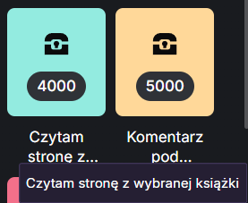

# 2025-12-27 - kacik czytelniczy: erotyki

## Co sie stalo

Na kanale Nocwelatu funkcjonuje nagroda za punkty kanalowe: przeczytanie jednej strony z wybranej ksiazki.
Nagroda jest droga (4000 punktow), dlatego odbierana jest rzadko. 27 grudnia 2025 zostala jednak zrealizowana.

## Kto bral udzial

- Szachowy Mentor
- widz, ktory uzbieral punkty i odpalil nagrode
- Koisuru (wskazana jako osoba, na rzecz ktorej przekazano wybor)

## Trigger

Triggerem byl sam odbior drogiej nagrody oraz wybor erotyka o elfach do czytania.

## Przebieg

Widz zrealizowal nagrode i przekazal wybor tekstu. Czytany byl erotyk o elfach.
Material zostal przypisany do watku kojarzonego z Koisuru.
Czytanie szybko stalo sie memiczne i zostalo opisane przez redakcje jako jeden z bardziej absurdalnych momentow koncowki 2025.

## Linki i klipy

- https://dai.ly/k2Rs5G9AFCQ58hEHbtK

## Skutek

Epizod utrwalil obraz "kacika czytelniczego" jako narzedzia do memicznych akcji na streamie, a nie realnej aktywnosci edukacyjnej.

## Powiazania

- [2026-01-02 - kacik spermiarski: Mentor meczy sie o samice](2026-01-02-kacik-spermiarski-koisuru.md)
- [2026-01-kacik-rzymianski-sodastream](../odzywianie/2026-01-kacik-rzymianski-sodastream.md)
- [2025-12 - wydarzenia wokol moderacji i streamingu](2025-12-wydarzenia.md)

