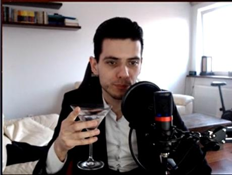
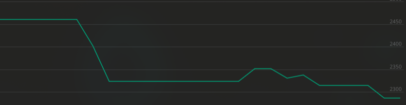
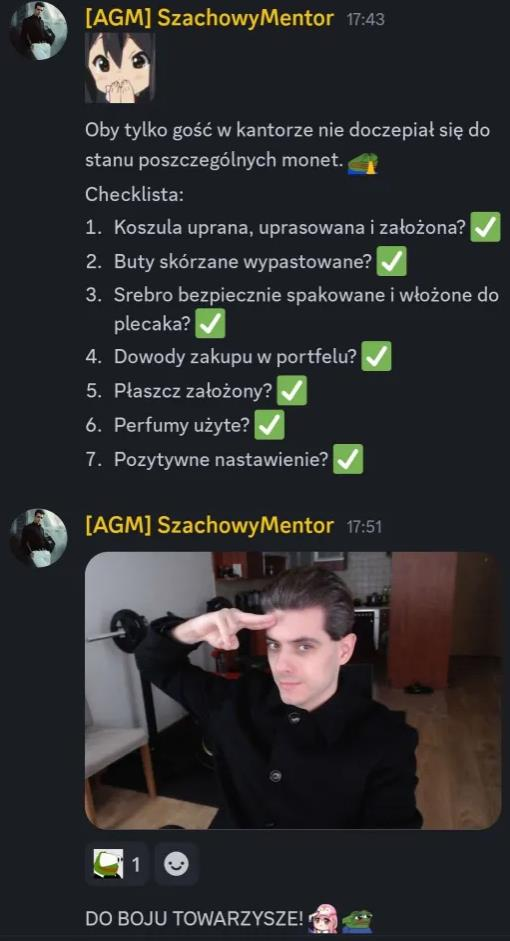
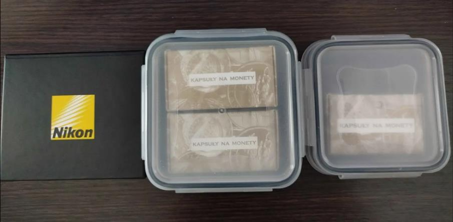

# „Jak wyszły postanowienia uszatego spella w ubiegłym roku?" — Ocena Postanowień Noworocznych 2025

**Data publikacji:** 31 grudnia 2025  
**Źródło:** Głos Waffen (Redakcja główna: Szałwia)  
**Temat:** Retrospektywa realizacji postanowień noworocznych Aleksandra Radomskiego na koniec roku 2025  
**Wynik:** 2/10 postanowień zaliczonych

---

## Co się stało

Na przełomie grudnia 2024 i stycznia 2025 Aleksander Radomski opublikował listę postanowień noworocznych na sobie dostępnych platformach. Redakcja Głosu Waffen postanowiła przeprowadzić audyt tego, jak faktycznie wypadała realizacja tych celów w ciągu całego roku 2025.

## Przebieg: Analiza Każdego Postanowienia

### Punkt 1: Wierzyć w Swoją Sprawczość i Dyscyplinę — **NIEZALICZAM**

Mentor's New Year's Resolution: "Bardziej wierzyć w swoją sprawczość i być bardziej zdyscyplinowany, aby lepiej przejąć kontrolę nad swoim życiem"

**Rzeczywistość:**
- Chaotyczne inwestycje (wali pieniądze bez analizy)
- Śpi o 5 rano bez regularności (brak dyscypliny czasowej)
- Ćwiczy raz w miesiącu (brak dyscypliny fizycznej)
- Emocjonalne decyzje pod wpływem chwili (brak sprawczości)
- Nie stosuje wiedzy z przeczytanych książek (brak umiejętności kontroli nad nauką)

**Verdict:** Postanowienie całkowicie niespełnione — mentor wykazuje się zbyt słabą dyscypliną i zbyt wielką bezbronnością wobec swoich impulsów.

### Punkt 2: Inwestycje — **NIEZALICZAM**

Mentor udostępnił opcje inwestycyjne (RGTI, SUI) na początku 2025 roku, które okazały się katastrofą finansową.

**Dokumentacja upadku:**
- Styczeń 2025: Zawarcie pozycji w RGTI i SUI
- Październik 2025: Inwestycja w papierach Lubawy SA — spadek **-30%**
- Grudzień 2025: Zagrożenie w IMC (ukraińska mleczarnia) — spadek **-6%** w ciągu zaledwie 2 tygodni

**Podsumowanie:** Seria złych decyzji inwestycyjnych bez fundamentalnej analizy. Całkowita strata na portfelu: **-6,040 PLN (-32.7%)** na wdrożonym kapitale 18,493 PLN (stan na 25 grudnia 2025).

### Punkt 3: Ćwiczenia — **NIEZALICZAM**

Mentor twierdził, że będzie ćwiczyć codziennie i uczyni ćwiczenia formą swojego stylu życia.

**Rzeczywistość:**
- Ćwiczy **raz w miesiącu** — jedynie gdy ktoś na streamie mu „odbierze" ławeczkę
- Brak jakichkolwiek zdjęć fitness na Discordzie czy Twitterze
- Metodologia wnioskowania: gdyby faktycznie ćwiczył, udostępniałby fotki (cecha charakterystyczna narcyzmu Mentora)

**Konkluzja:** Postanowienie całkowicie nierealizowane.

### Punkt 4: Szachy — **ZALICZAM**

Mentor rzeczywiście ćwiczy szachy, ale nie w formie tradycyjnej.

**Sposób realizacji:**
- Gra 3-5 godzin na anonimach z niskim ratingiem (traktuje to jako „rozgrzewkę")
- Następnie gra przeciwko graczom o **200 punktów ELO niżej od siebie**
- Efektem jest utrzymywanie złudzenia kompetencji poprzez wybór słabszych przeciwników

**Verdict:** Techniczne zaliczenie, ale z duża ironią.

### Punkt 5: Dieta — **NIEZALICZAM**

Mentor twierdził, że będzie się lepiej odżywiać.

**Rzeczywista dieta Mentora:**
- Główne składniki: oranżada, **7,5 kg mandarynek**, mrożonki (paella, pierogi)
- Brak równowagi między węglowodanami, białkami, tłuszami
- Szałwia ironizuje: „jeśli Mentor uważa, że dieta na oranżadzie, Helenie i mandarinkach jest lepsza niż na chrupkach, żelkach i kebabach, to tak, odżywiał się lepiej"

**Ocena:** Ilościowa zmiana składu, ale bez rzeczywistej poprawy zdrowia.

### Punkt 6: Sen o Wyznaczonych Godzinach — **NIEZALICZAM**

Mentor chciał mieć regularny harmonogram snu.

**Rzeczywistość:**
- Śpi o **5 rano po sexingu z kasiunia19 na GaduGadu**
- Brak regularności
- Przepaść między planem a rzeczywistością

### Punkt 7: Streaming by Spełnić Warunki Kicka — **ZALICZAM**

Mentor chciał regularnie streamować, aby spełnić warunki umowy z platformą Kick.

**Realizacja:**
- Mentor faktycznie streamuje regularnie
- Utrzymuje minimalny poziom aktywności wymagany przez Kick
- Mimo że wyniki są podejrzane (botowanie widoków), techniczny wymóg — streamowanie — został spełniony

**Konkluzja redakcji:** Jedyne postanowienie z pełnym sukcesem, choć metodyka jest wątpliwa.

### Punkt 8: Czytanie — **NIEZALICZAM**

Mentor przeczytał kilka książek w ciągu roku.

**Problem:**
- Bezużyteczność wiedzy — nigdy nie stosuje jej na streamie
- Cytując Szałwię: „Dosłownie gdyby używał wiedzy z książek, które czytał na streamie, to nie byłby na -6k PLN"
- Czytanie bez zrozumienia i aplikacji praktycznej

### Punkt 9: Control Finansów (Allegro Pay) — **NIEZALICZAM**

Mentor używa Allegro Pay do „kontrolowania finansów".

**Rzeczywistość:**
- Allegro Pay to system odroczonych płatności (kupujesz teraz, płacisz za miesiąc)
- Uszaty robi „drobne zakupy" przez Allegro Pay
- To nie jest kontrola — to utrudnianie budżetowania

### Punkt 10: Romanse — **NIEZALICZAM**

Mentor chciał znaleźć partnerkę.

**Przebieg:**
- Jedyną „sukcesem" była Napoleonka
- Kiedy dowiedziała się, jaki naprawdę jest Mentor (misoginia, zaangażowanie Waffen)
- **Kopnęła go w dupę** — koniec relacji
- Poza Napoleonką: jedynie trollowanie na GaduGadu i „fotce"

**Konkluzja redakcji:** „Big W for WAFFYN" (sarcasm alert)

---

## Podsumowanie Výsledku

| Postanowienie | Wynik | Komentarz |
|---|---|---|
| Sprawczość i Dyscyplina | **NIEZALICZAM** | Brak kontroli nad życiem |
| Inwestycje | **NIEZALICZAM** | -6,040 PLN straty |
| Ćwiczenia Fizyczne | **NIEZALICZAM** | Raz w miesiącu |
| Szachy | **ZALICZAM** | Granie na słabszych |
| Dieta | **NIEZALICZAM** | Oranżada i mandarynki |
| Sen | **NIEZALICZAM** | 5 rano, bez regularności |
| Streaming/Kick | **ZALICZAM** | Regularne transmisje |
| Czytanie | **NIEZALICZAM** | Bezużyteczna wiedza |
| Finanse | **NIEZALICZAM** | Allegro Pay nie to |
| Romanse | **NIEZALICZAM** | Napoleonka go kopnęła |

**Ostateczny wynik:** **2/10** (Szałwia: „Jak na mentora bardzo dobry wynik")

---

## Rekordy Szachowe: Upadek Na Lichessie

### Ranking Rapid (szachy szybkie)

**Dane:**
- **8 grudnia 2025:** Ranking 2477 ELO (apogeum)
- **29 grudnia 2025:** Ranking 2272 ELO (upadek)
- **Różnica:** -205 ELO w 3 tygodnie

### Przyczynowość Według Agentów (Szałwia)

Mentor żalił się, że jego telefon „działa gorzej". Wnioskowanie:
- Przyczyną regresu jest telefon
- Telefon „odmawia współpracy" — podobnie jak kiedyś była Edyta
- Mentor kupił nowy smartfon

**Otwarte pytanie:** Co Mentor zrobił ze starym telefonem?
- Widzowie pytali na chacie — brak odpowiedzi
- Szałwia: można się domyślić, że urządzenie „podzieliło swój los z Edytą" (żart o wyrzuceniu/usunieciu)

---

## Kącik Inwestorski: Srebrny Baron w Świetle Jupiterów

### Kontekst: Materiał SzklanaY2J

Redakcja SzklanaY2J opublikowała materiał poświęcony rosnącym cenom srebra i potencjalnemu wzbogaceniu się Srebrnego Barona.

**Link:** https://youtu.be/_mMZB4A1bqA?si=TXi63B3LrhqZMtS3&t=222

### Komentarz Mentora

- Mentor usłyszał o materiale
- Odpowiedział komentarzem pod materiałami satyrycznymi
- Był urażony ujęciem w redakcji

### Prawda o Srebrze

**Co mówił SzklanaY2J:** Rosnąca cena srebra wzbogaciła Mentora

**Rzeczywistość wg. Głosu Waffen:**
- Mentor **sprzedał WSZYSTKIE swoje monety w wrześniu 2025**
- Powód: Zakup laptopa do pracy zdalnej (mimo że pracuje stacjonarnie w optyku)
- W istocie: **całkowicie chybił metkę** — sprzedał dokładnie przed wzrostem ceny

### Anegdota: Wycieczka do Mennicy

Mentor poszedł na wycieczkę do mennicy w:
- **Zimowym płaszczu**
- Mimo że temperatura wynosiła **20°C**

**Smutna ironia:** Pojemniki na żywność, które kupił dla „Żywiołaka Majeranku" (do przechowywania jedzenia), jedynym praktycznym zastosowaniem były... **jajca gotowane w tym płaszczu** (???)

---

## Krytyka Redakcji: Brak Riserczu SzklanaY2J

Głos Waffen porównuje podejście do investigacji:
- **SzklanaY2J:** Opiera się na pogłoskach, brak faktycznego badania („Szklana czerwona karteczka, leniwa kurwo")
- **Głos Waffen:** Faktyczne risercze — weryfikacja każdego wariantu

---

## Dodatkowa Obserwacja: Wykształcenie (?

Z wiadomości napisanej przez Mentora można wydedukować:
- Mentor skończył gimnazjum w wieku **20 lat** (?)
- Prawdopodobnie **brak matury**
- **Pracuje stacjonarnie jako optyk** (podczas gdy twierdzi pracować zdalnie)

---

## Życzenia Noworoczne Redakcji

Redakcja Głosu Waffen życzył czytelnikom powodzenia, ale z złośliwym zadysem:

> Niech wszystko, co sobie zaplanujecie będzie równie udane, co inwestycje Wielkiego Inwestora.
> Niech wasze życie uczuciowe kwitnie niczym związek Srebrnego Kochanka z Napoleonką (no bo przecież dalej są razem, cnie [SARCASM]).
> Abyście rozwojem dorównywali rozwojowi Aleksandra na drodze do tytułu Arcymistrza Szachowego.

**Zakończenie:**
- Zbazowane życzenia dla Was — pozdro z fartem
- *Jebać uszatka!*

---

## Powiązania

- [2025-12-11 - Napoleonka: siedmiodniowy romans i ideologiczna hipokryzja](../zwiazki/2025-12-11-napoleonka-siedmiodniowy-romans.md) — historia z Napoleonką
- [2025-12 - Kącik Inwestycyjny: IMC spada do -6%, Mentor uczy się trudnych lekcji](../inwestycje/2025-12-kacik-inwestycyjny-imc.md) — analiza portfela
- [2024-11 - rekordy szachowe mentora na lichessie](../figle/2024-11-rekordy-szachowe.md) — porównanie wyników Lichessa
- [Szachowy Mentor - profil i chronologia](../profil/szachowy-mentor.md) — profil główny

---

**Redakcja główna:** Szałwia || **Redakcja:** Capybara, Alyson Stark  
**Wymiana:** Głos Waffen (31.12.2025)
