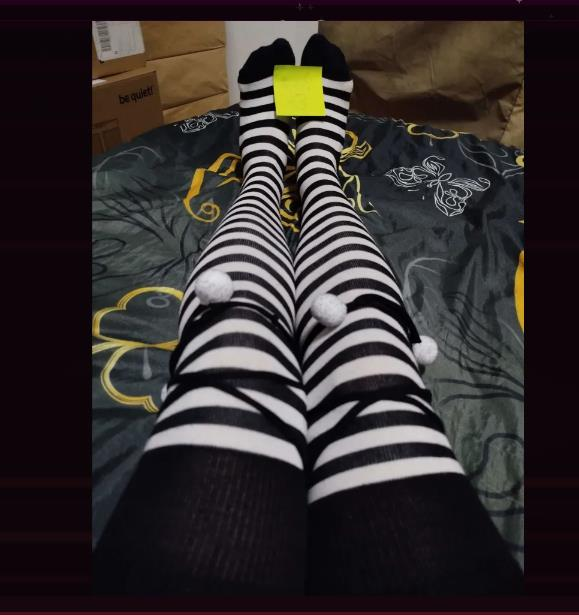

# 2025-12 - Ciekawostka: Zakolanówki i Fetyszyzm Mentora

## Co się stało

W sekcji "Ciekawostka" Głosu Waffen pojawiło się zdjęcie mentora w **zakolanówkach w paski** (striped knee-high socks).
Redakcja zanotowała: "Srebrny Baron wielokrotnie zakładał zakolanówki i wysyłał zdjęcia do widzów tutaj przykładowe."
Materiał dokumentuje publiczną ekspozycję fetyszystycznych preferencji mentora.

## Kto brał udział

- Szachowy mentor (noszący zakolanówki)
- Widzowie (odbierający zdjęcia)
- Redakcja Głosu Waffen (dokumentująca)

## Treść Zdjęcia

Zdjęcie pokazuje:
- Osobę w zakolanówkach w czarno-białe paski
- Nogi na łóżku (czarne prześcieradło z złotym deseniem)
- Karteczkę z numerem ("1") — potencjalny znak "to jest zdjęcie 1"
- Pozycja: leżąca, nogi wyposażone w zakolanówki

## Analiza Fetyszyzmu Zakolanówki

### 1. Zakolanówki jako Symbol Seksualizacji

Zakolanówki są **silnie skojarzone z seksualizmem** w kulturze internetowej:
- Fetysz "schoolgirl" (uczenice/ściupki)
- Asocjacja z "innocence" (niewinność) + seksualizacja
- Dominacja w anime/manga/internet porn

Mentor noszący zakolanówki i wysyłający zdjęcia = **deliberate sexualization**.

### 2. "Wielokrotnie Zakładał"

Redakcja mówi "wielokrotnie" (nie jeden raz) — to sugeruje:
- Seria zdjęć zakolanówek
- Potencjalnie progression (coraz bardziej "odsłonięte")
- Znormalizowanie dla mentora = coś, co robi regularnie

### 3. "Wysyłał Zdjęcia do Widzów"

To jest **direct communication z fanami/widzami** na temat swoich fetyszów.
To sugeruje:
- Brak granic Privacy vs. Public
- Mentor chce się pokazywać zwolennikom
- Potencjalny quid pro quo (pamiętaj, że zakolanówki mogą być kłopotami dla widzów)

### 4. "Tutaj Przykładowe"

Słowo "przykładowe" sugeruje, że tam było więcej zdjęć.
To jest seria, nie jednorazowy incydent.

## Psychologia Mentora

### 1. Sexualization Jako Forma Kontroli

Mentor pokazuje zakolanówki (symbol infantylizacji) — to jest formą **power play**:
- "Ja mogę być seksualizowany/infantylizowany"
- "Możesz mnie widzieć w tym stanie"
- "To mi daje władzę nad tobą"

### 2. Boundary Dissolution

Dla normalnie działającego człowieka:
- Prywatne fetysz ≠ publiczne zdjęcia
- Mentor robi to deliberately

Dla mentora: **brak granic** między swoją seksualnością a publiczną ekspozcją.

### 3. Granie z Infantylizmem

Zakolanówki są odsądzane jako "cute", "innocent", "girl-like" — ale mentor jak facet to nosi.
To jest meta-sexualizacja: "Ja (dorośly mężczyzna) noszę infantylne ubierko" = **fetyszyzm**.

## Powiązania do Innych Obsesji

| Obsesja | Medium | Forma |
|---------|--------|-------|
| **Stópki (rozmiar 44)** | GaduGadu rozmowy | Textowe pytania |
| **Cream-licking** | GaduGadu rozmowy | Tekstowe fantazje |
| **Koisuru (brudne wiadomości)** | Discord | Seksualny komentarze |
| **Zakolanówki** | Zdjęcia | Wizualne eksponowanie |
| **Lady Hetman (drag)** | Memy/archiwa | Fikcyjna character |

Wszyscy razem: **wieloformowy fetyszyzm** mentora.

## Skutek

### Krótkoterminowo
- Ujawnienie zakolanówki zdjęć
- Humiliacja publiczna
- Memy na Discord

### Długoterminowo
- Potwierdzenienie: mentor ma **otwarty fetyszyzm**
- Dowód: brak granic między prywatnym a publicznym
- Pytanie: czy widzowie odbierali to jako zagrożenie czy jako rozrywka?

### Dla Społeczności
Jeśli mentor wysyłał zakolanówki zdjęcia osobom mniejszej wiary (młódsze osoby, lojalist):
- To może być forma **grooming** (przygotowywanie do seksualizacji)
- To jest manipulacja poprzez sexualizację figure autorytetu

## Powiązania

- [2025-12 - GaduGadu: obsesja na stopach, cream-licking](../../zwiazki/2025-12-gadugadu-obsesja-na-stopach.md)
- [2025-12 - Kącik Spermiarski: brudne rozmowy Koisuru](../figle/2025-12-kacik-spermiarski-koisuru.md)
- [2026-02 - cosplay i romantyzm: Koisuru case study](../../zwiazki/2026-02-koisuru-cosplay-i-romantyzm.md)
- [2025-12 - analiza stylu manipulacyjnego mentora](../../zwiazki/2025-12-analiza-stylu-manipulacyjnego.md) (obsesja na szczegółach)
- [2024-01 - fabryka fejk kont i tozsamosc "Lady Hetman"](../figle/2024-01-fabryka-fejk-kont-i-lady-hetman.md)
- [Głos Waffen - archiwum](../../../zrodla/README.md)
- [Szachowy mentor](../../profil/szachowy-mentor.md)

## Screeny

