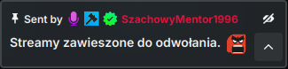
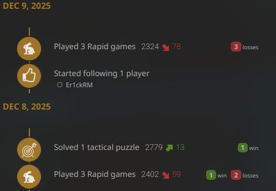
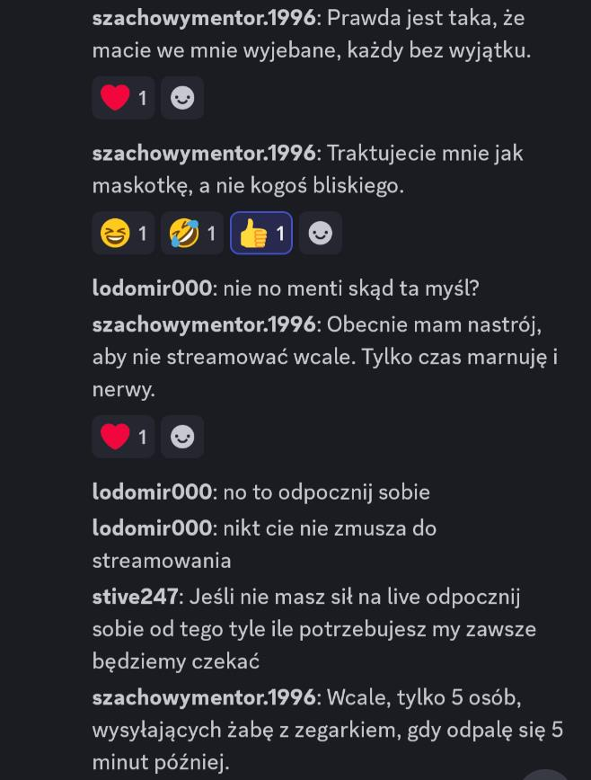

# 2025-12 - mentor zawiesza kariere streamerska

## Co sie stalo

9 grudnia 2025 mentor oglosil tymczasowe zatrzymanie streamowania na Kick.com.
W komunikatach laczyl ten ruch z frustracja niskimi efektami (spolecznosc, sprzedaz ksiazki, nastroj po transmisjach).
W relacjach redakcyjnych pojawila sie tez teza, ze dodatkowym zapalnikiem mogl byc spadek wynikow rankingowych na lichess.

## Kto bral udzial

- Szachowy mentor
- widzowie Kick i Discorda
- redakcja i komentatorzy analizujacy powod przerwy

## Trigger

Triggerem byla kumulacja kilku czynnikow: gorszy nastroj po streamach, napiecie z aktywnoscia Waffen XN, slabiej przyjety odbior sprzedazy podrecznika i potencjalna frustracja wynikami szachowymi.

## Przebieg

9 grudnia mentor poinformowal widownie o przerwie na Kick.
Na Discordzie sygnalizowal brak satysfakcji ze skali i jakosci "community szachowego" oraz rozczarowanie odzewem sprzedazowym.
Pod koniec streama padla deklaracja, ze transmisje nie poprawiaja mu nastroju.

Material klipowy:
- https://streamable.com/ngftn7

Rownolegle redakcja wskazywala inny mozliwy powod: analiza profilu lichess i utrate 137 punktow rapid po serii 5 porazek z rzedu.
W komentarzu eksperckim z materialu podkreslano, ze spadek ELO mogl byc "iskra", a nie jedynym czynnikiem.

Wedlug stanu z 12.12.2025 mentor utrzymywal postanowienie i od 3 dni nie uruchamial transmisji.
Dodatkowa aktualizacja z 10.12.2025 wzmacniala ton autorefleksji o marnowaniu czasu przez streaming.

## Skutek

Epizod utrwalil obraz grudnia 2025 jako okresu, w ktorym mentor publicznie bilansowal sens dalszego streamowania.
Przerwa stala sie centralnym punktem kolejnych debat o jego priorytetach i stanie psychicznym.

## Linki i klipy

- https://streamable.com/ngftn7

## Powiazania

- [Grudzien 2025 - wydarzenia wokol moderacji i streamingu](2025-12-wydarzenia.md)
- [2025-12 - plany na przyszlosc mentora](../inwestycje/2025-12-plany-na-przyszlosc-mentora.md)
- [Szachowy mentor](../profil/szachowy-mentor.md)
- [Rejestr autorstw artykulow](../postacie/waffenowcy/autorstwa-artykulow.md)
