# 2025-12 - wyznania arcymistrza

## Co sie stalo

W grudniu Szachowy Mentor po raz kolejny urzadzil dluga, wielowatkowa spowiedź na styku refleksji, samozaprzeczen, mizdrzenia sie do samego siebie i klasycznego uciekania w chochoły.
W jednym wydaniu zbitka wątków dotyczyla jednoczesnie rozmow o moderacji, odgrzewanego romansu, marzen o utopii Discordowej, inwestycji, jedzenia, dziwacznych galeryjek i zapowiedzi gry opartej na trollerskim uniwersum.

## Kto bral udzial

- Szachowy mentor / Aleksander Radomski
- Laylo
- osoby z Discorda, ktore probowaly cos wytlumaczyc
- redaktorzy rozpisujacy kolejne segmenty
- partnerka z wątku flirtowo-sextingowego, znana z wymiany o rzeczach "po stopach" i innych groteskowych sygnałach

## Trigger

Triggerem byla grudniowa akumulacja frustracji, atencji i potrzeby budowania wokol siebie narracji o kontroli.
W praktyce wszystko odpalało sie od jednego: od wrazenia, ze mentor musi wypluc kolejna porcje zludzen, zanim znowu wróci do codziennego, 364-dniowego chaosu.

## Przebieg

### Wyznania arcymistrza

Raz do roku grudzien uruchamia w nim krótką chwile refleksji. Trwa ona mniej wiecej minute, po czym wraca standardowy tryb dzialania: samozaprzeczenie, napiecie i dryf po własnych chochołach.

W tej rozmowie szybko okazalo sie, ze nawet spokojne i racjonalne tlumaczenia nie przebijaja sie przez warowne mury jego przekonan. Mentor uciekl od konkretu i przeszedl do walki z kolejnymi uproszczeniami, jakby rozmowca nie mowil do czlowieka, tylko do konstruktu zbudowanego z urazow.

Najmocniejsze fragmenty tej sekcji to seria sprzecznosci:

- nie ocenia ludzi po rzeczach powierzchownych, chyba ze akurat chodzi o rzeczy, ktorych nie lubi
- nie lubi skupiania sie na wygladzie, chyba ze to on sam sie na tym skupia i sam siebie w to ubiera

W tle pojawia sie tez bezpiecznik na jego swiadomosci, czyli wierny moderator, ktory pozwalal mu zderzac ego z rzeczywistoscia bez natychmiastowego eksplodowania.

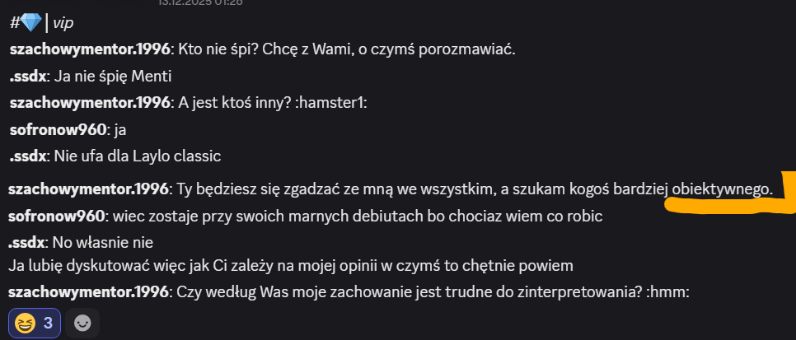

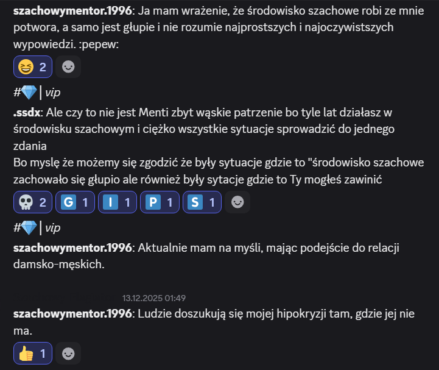

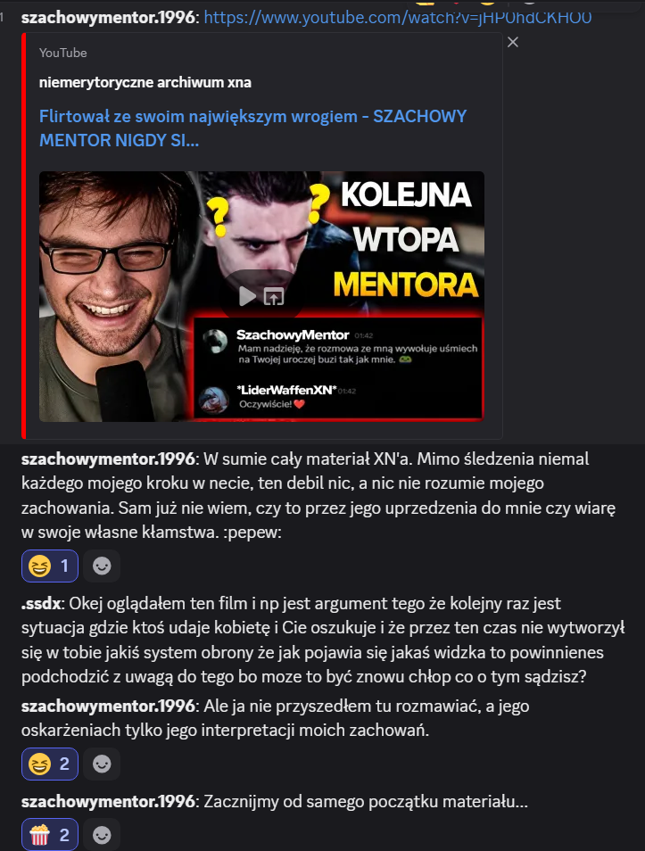

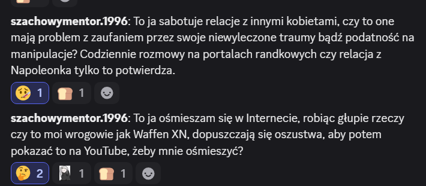

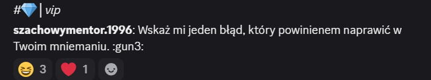

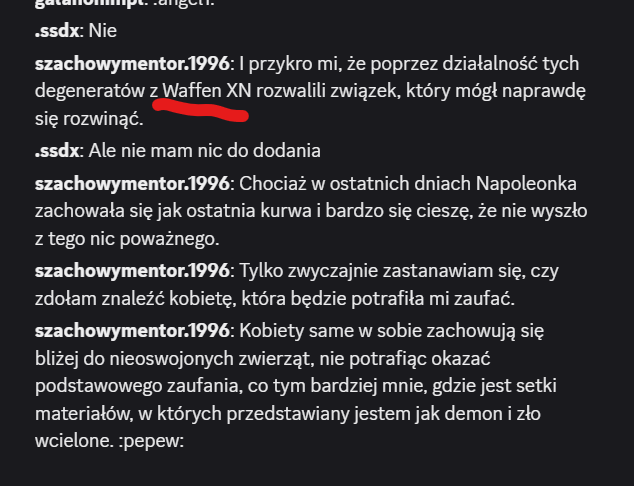

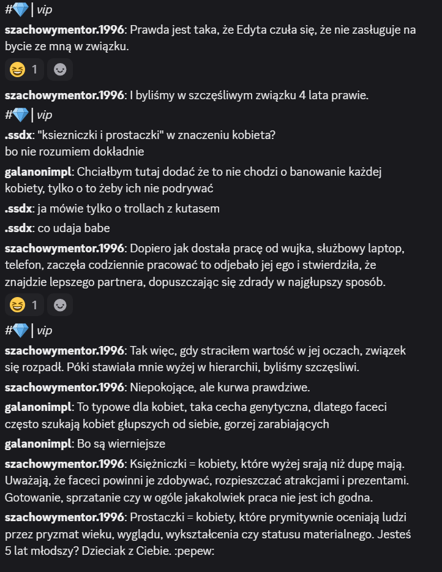

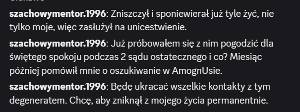

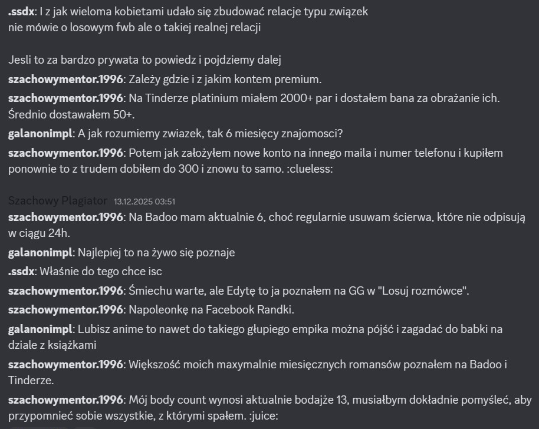

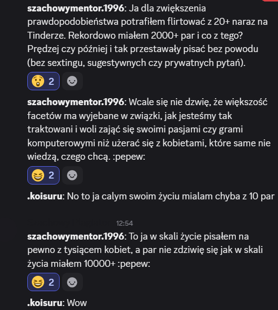

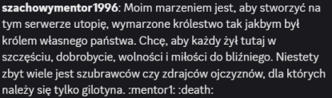

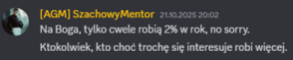

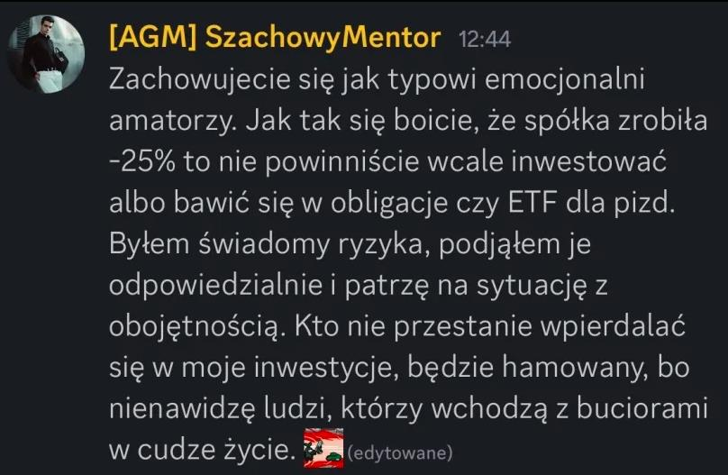

### Mentor zbyt idealny? Podboje milosne ciag dalszy!

Zerwanie z Napoleonką nie zatrzymalo poszukiwania atencji i nowej narracji o milosci.
Mentor przeniosl swoje dzialania na kolejne platformy i zaczal przypominac starsze taktyki, lacznie z wracaniem do dawnych miejsc i starych nawykow manipulacyjnych.

Istotny jest tu szczegol: nie chcial, by wieść o tym poszukiwaniu milosci na GaduGadu czy innych miejscach wyleciala do jego "śmiertelnych wrogów".
Oczywiscie skonczylo sie odwrotnie - wrzuceniem screenow na Discorda, do ktorego Waffen rzekomo nie mial dostepu.

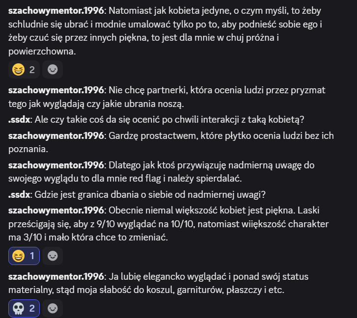

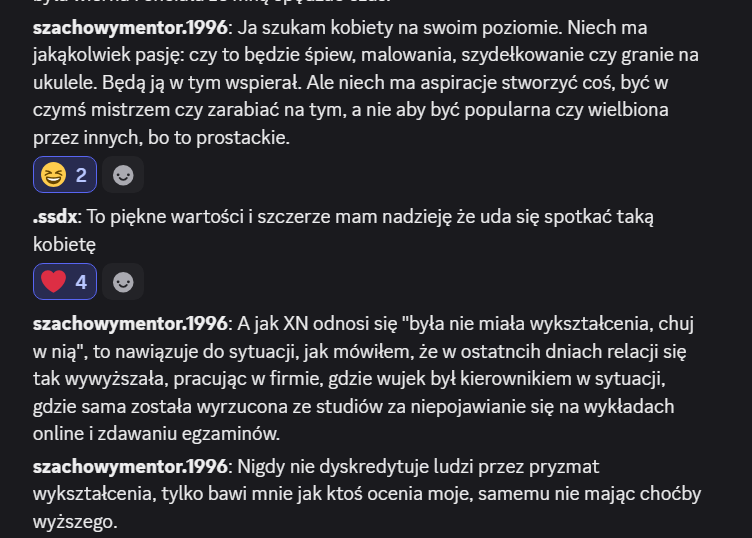

Wtedy rozwinela sie sekwencja sextingowa, ktora z boku wygladala jak połączenie żartu, prężenia ego i kompletnego rozmycia granic:

- zaczelo sie od rozmow o ksiazkach i bajeskach
- pojawil sie temat uroku partnerki
- doszlo do wymiany o stopach i rozmiarach
- padla granica 44 jako gorna granica, jakby to byla jakas objawiona prawda o wszechswiecie

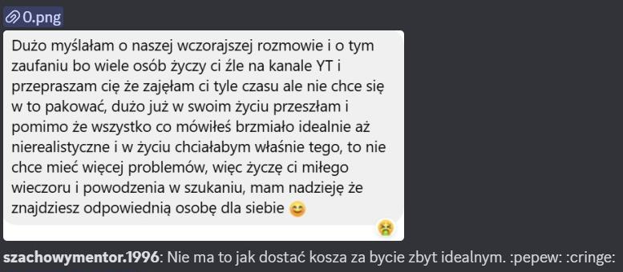

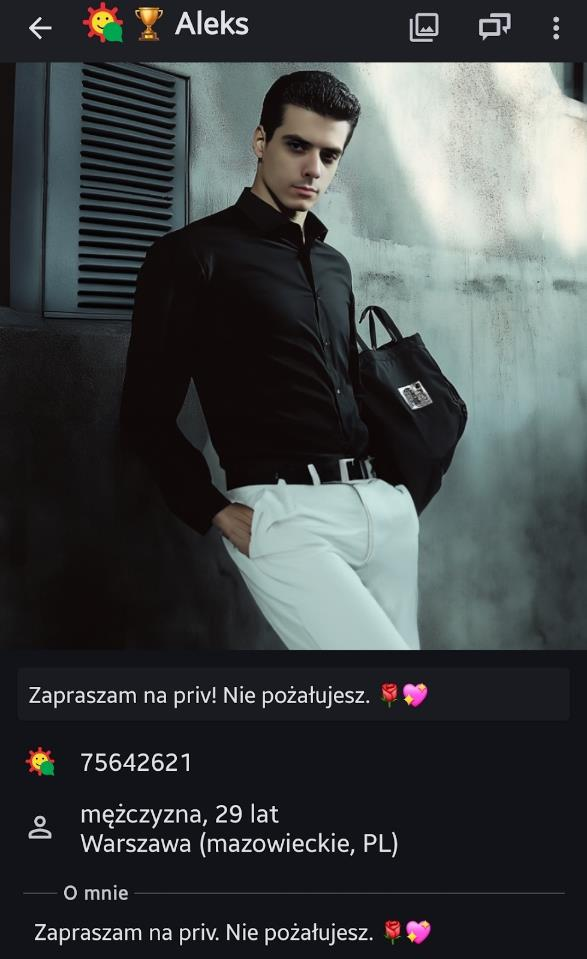

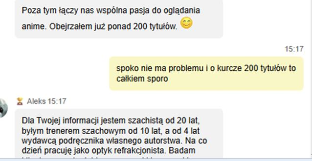

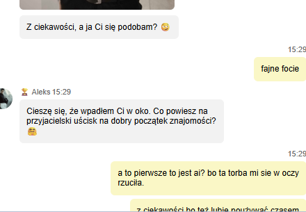

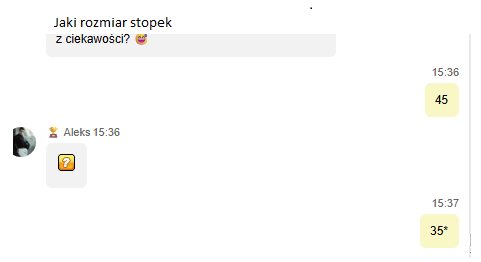

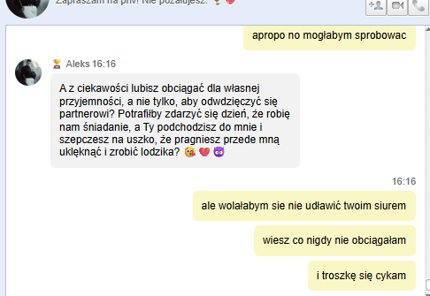

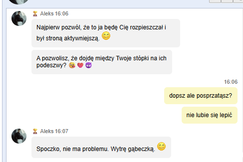

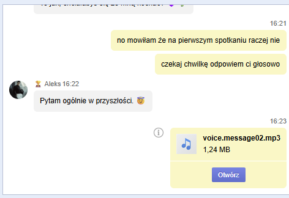

Wszystko rozladowal dopiero wlaczony "Agent W", ktory spalił przykrywkę wysylajac zakamuflowaną wiadomosc głosową z utworem "Szachowa Przyjaźń".
To wlasnie tutaj ląduje klip:

<video src="../../assets/screenshots/2025-12/qpjt10.mp4" controls></video>

- https://streamable.com/qpjt10

### Marzenia discordowe imperatora 12%

Kolejny segment to autopromocyjny monolog o tym, jak mentora nalezy traktowac jak króla utopii.
W jego marzeniach Discord nie jest zwyklym serwerem, tylko przyszlym królestwem, które trzeba podporzadkowac, oczyścić i zbudować od nowa.

W jawnie groteskowej wyliczance pojawia sie wizja:

- stworzenia utopii
- zbudowania niesamowitego królestwa
- zostania krolem cudownego kraju
- trzymania gilotyny dla szubrawców jako symbolu porzadku

Najbardziej uderza jednak nie sama tresc, tylko pewnosc siebie, z jaka to jest wypowiadane.
To nie jest plan. To jest rytualne oglaszanie własnej waznosci.

Red. Nicość.

### Podboje gieldowe Pana Aleksandra

Wątek inwestycyjny to juz klasyczny mentorowy miks wyzszosci, pretensji i przesadnej wiary w spryt.
Z jednej strony lubi mowic, ze 2% rocznie to nic, 5% to zabawa dla dziadkow, a prawdziwe pieniadze robi sie inaczej.
Z drugiej - sama historia jego ruchow na rynku pokazuje, jak czesto ideologia przegrywa z rzeczywistoscia.

W tej sekcji opisuje sie kilka klesk inwestycyjnych:

- RGTI kupione na dwa razy za lacznie 4000 zl i sprzedane z wygladnie brzmiacym, ale rozmytym zyskiem w dolarach
- Synektika
- SUI z utrata około 52%
- Lubawa z ruchem rzedu -30% i narracja o tym, ze inni to emocjonalni amatorzy

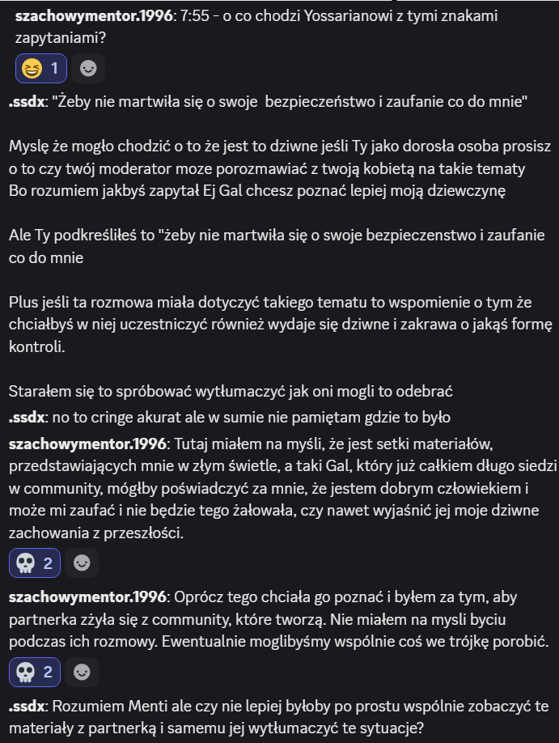

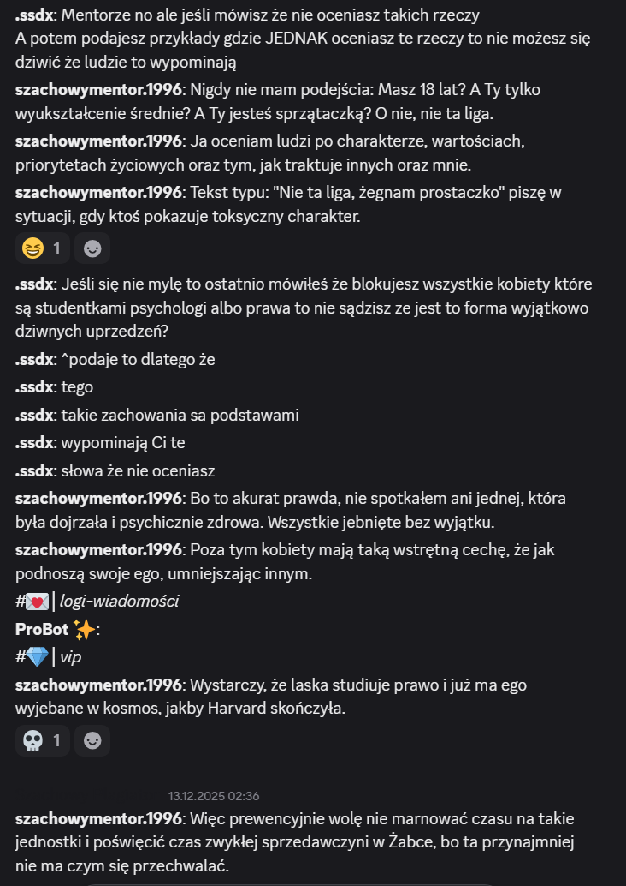

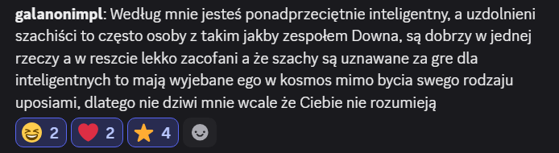

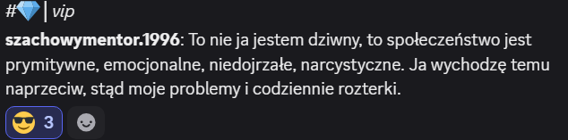

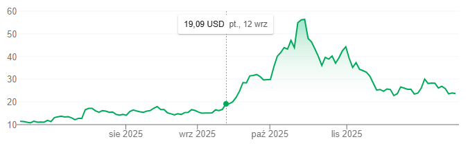

W efekcie, zamiast samokrytyki, dostajemy klasyczne: "gilotyna dla każdego kto się wpierdala".
To dobry skrót jego stylu - najpierw krytykuje innych, potem odpycha kazdego, kto zadaje pytanie.

Red. Ajwłasz.

### Drobne detale i redakcyjny smietnik

Te male obrazki i ikonki wygladaja jak odpadki po calym pakiecie, ale pasuja do tonacji: niby nic, a jednak kazdy z nich doklada kilka gramow groteski.

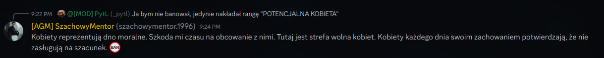

### Kacik kulinarny

W tle tego calego bogactwa ego i finansowych pretensji pojawia sie bardzo przyziemny detal: jedzenie.

Mentorowa lodowka przez dluzszy czas swiecila pustkami, ale redakcja przypomina, ze kiedys ulubione bylo Mexican Chicken od Frosty - kurczak z ryzem po meksykansku, do tego delikatny akcent oregano.

Wpis podaje nawet quasi-przepis, ktory w praktyce sprowadza sie do smieszkowego minimalizmu:

- Mexican Chicken
- 5 lyzek stolowych

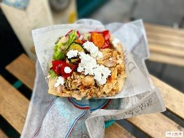

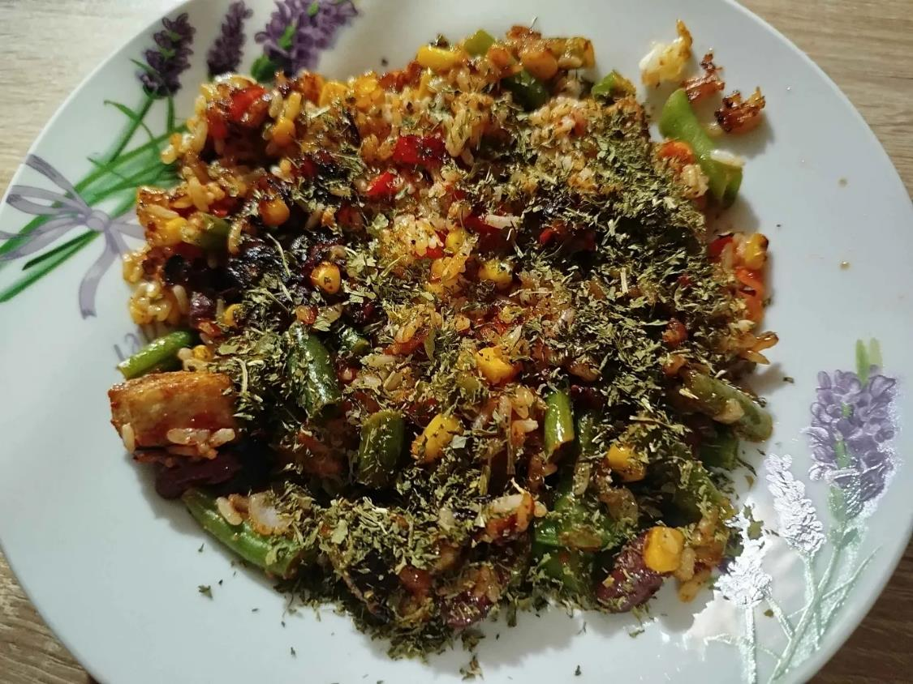

Czyli klasyczne: rozmrozić, podgrzac, przyprawic, zjeść.
Niby kuchnia, a jednak dalej styl pisania pozostaje ten sam: z przekasem, z poziomu redakcyjnej wyzszosci i z lekkim obrzydzeniem wobec samego zainteresowanego.

Red. Jadeit.

### Kacik Uszaty

Tu materiał schodzi juz do poziomu czystego fetyszu i galerii dla fanow odstajacych uszu.
Tekst nie udaje, ze jest subtelny: to jawnie satyryczny, brutalnie prosty dopisek dla czytelnikow, ktorzy szukaja dziwnych obrazkow i jeszcze dziwniejszej persony.

W praktyce to nie tyle osobna analiza, co zlosliwy przerywnik utrzymujacy groteskowy ton calego wydania.

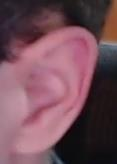
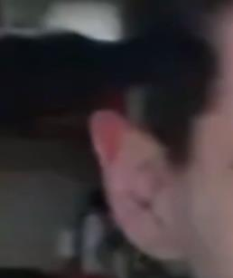

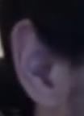

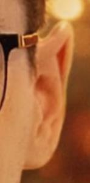

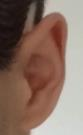

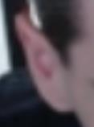

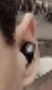

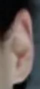

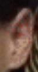

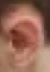

Red. Capybara, capybara capybara capybara capybara.

### WAFFEN TACTICS

Na koniec dochodzi zapowiedz gry opartej na uniwersum trollerskim.
Tytul to Waffen Tactics, a inspiracja jest jasna: ma byc wszystko, co znane z lokalnego piekla postaci, konfliktow i pseudo-strategicznego chaosu.

Materiał zapowiada:

- gre robiona na wzor TFT
- obecność znanych postaci z uniwersum
- maly leak V
- linki promocyjne i wstawki, ktore tylko dodaja absurdu

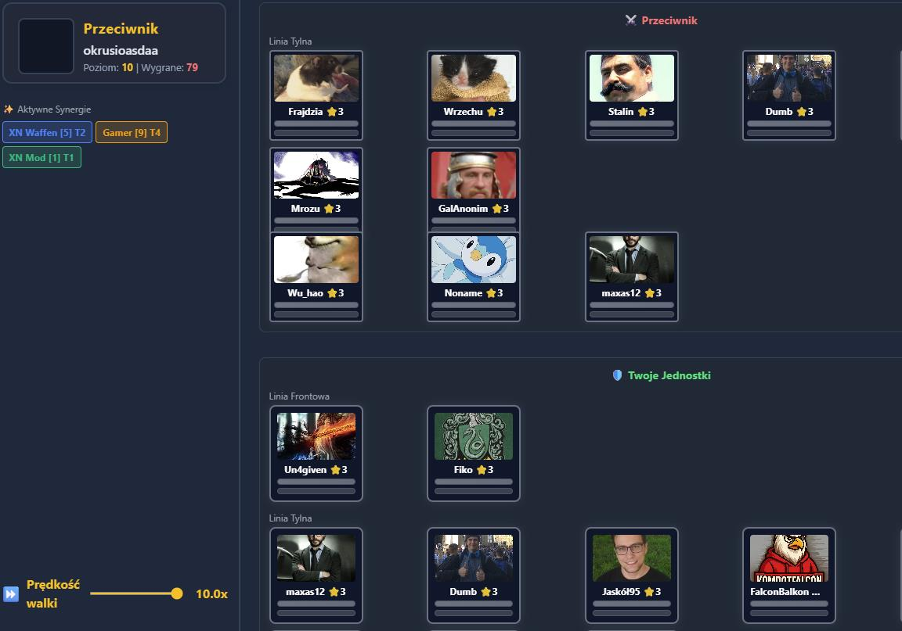

### Bonus i reszta odpadkow

Na koniec zostaje bonus dla tych, ktorzy przebrneli przez calosc.
To juz nie jest zwykla sekcja, tylko czysta demonstracja, ze autorzy tekstu czerpia satysfakcje z faktu, ze ktos jeszcze nie uciekł.

## Skutek

Wydanie pokazuje mentora jako osobe funkcjonujaca jednoczesnie na kilku poziomach groteski:

- chce uchodzic za mądrzejszego od wszystkich
- w praktyce zapada sie w serię sprzecznosci
- przelacza sie miedzy nostalgią, agresją, seksowaniem i pretensjami finansowymi
- zupelnie nie widzi, jak bardzo jego własne wypowiedzi niszcza spojnosc tej narracji

To wlasnie przez takie teksty postac mentora robi sie jednoczesnie tragikomiczna, męcząca i dziwnie hipnotyczna.

## Linki i klipy

- https://streamable.com/qpjt10
- https://chomikuj.pl/szybkamaszynka
- https://kick.com/ParisPlatynov
- https://www.twitch.tv/kasiunia%3C3

## Powiazania

- [Szachowy mentor](../profil/szachowy-mentor.md)
- [2025-12 - wydarzenia wokol moderacji i streamingu](2025-12-wydarzenia.md)
- [Pseudonimy Szachowego Mentora](pseudonimy-szachowego-mentora.md)
- [Rejestr autorstw artykulow](../postacie/waffenowcy/autorstwa-artykulow.md)