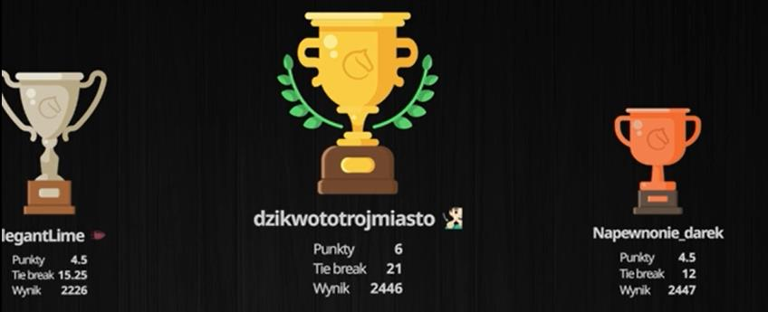

# Turniej Sylwestrowy: Mentor Zakazuje Nagród Waffen

**Data publikacji:** 8 stycznia 2026  
**Źródło:** Głos Waffen (Redakcja: Szałwia)  
**Temat:** Turniej szachowy zorganizowany przez Mentora na Sylwestra z zakazem wydawania nagród osobom ze społeczności Waffen

---

## Co się stało

Na Sylwestra (31 grudnia 2025) Aleksander Radomski zorganizował turniej szachowy, którego nagrodami były kursy debiutowe oraz książka. Turniej szybko stał się cyrkiem, gdy osoby z kręgu "figlarzy" (waffenowcy) rozpoczęły masowe uczestnictwo.

## Zakaz dla Waffen

Przed turniejem Mentor wyraźnie oznajmił: **żaden członek społeczności Waffen nie otrzyma nagrody**, niezależnie od wyniku.

**Wymowny cytat:** "Od razu poinformował, że żaden waffenowiec książki nie dostanie i jest to OCZYWISTE."

Mentor uzasadniał to tym, że nie chce wspierać „trollerskiej społeczności".

## Bezpodstawne Oskarżenia: Białywiłek i Dokładność

### Incydent z Białywiłkiem

Białywiłek (członek Waffen) uczestniczył w turnieju i zagrał jedną partię. Mentor **natychmiast oskarżył go o oszukiwanie** na podstawie простого faktu, że waffenowiec wygrał.

**Logika Mentora:** "Jak waffenowiec może wygrać z widzem Mentora? To musi być cheating!"

**Dowód rzekomego oszustwa:** Białywiłek wykazał niezwykłą dokładność ruchu (bardzo wysokie % accuracy).

Mentor, zamiast przyjąć porażkę, zwie Białywiłka niedokładnie i oświadczył:

> "Oby każda osoba, która w jakikolwiek sposób się wspierała, została natychmiast wyrzucona"

### Rzeczywisty Ranking Białywiłka

Szałwia z redakcji zwraca uwagę:

> **Białywiłek ma ranking na Chess.com, którego Uszatek nigdy nie zdobędzie.**

To oznacza, że wysoka dokładności może być **naturalnym wynikiem kompetencji**, a nie cheatingiem.

## Hipokryzja: Dokładność Mentora

Po turnieju Mentor sprawdził jedną z partii swojego **własnego widza**. Kiedy widz wykazał wysoką dokładność, Mentor:

- Nie oskarżył go o cheating
- Zaakceptował rezultat bez komentarza
- Powiedział: "Jego widzowie mogą tak grać"

**Konkluzja redakcji:** Dyskryminacja na podstawie afiliacji — jeśli cheating Białywiłka to problem, czemu nie cheating Mentora?

## Spamowanie Linkami do Streama

Podczas turnieju kilka osób (podejrzewane botów Mentora) zaczęło spamować linkiem do jego streama na Twitchu:

- **Kanał:** https://www.twitch.tv/szachowyyakuza1996
- **Cel:** Kierowanie widoków do restreamów

## Podium Turnieju

Konkretne wyniki nie sprawdzały się kryteriami sprawdzenia, ale struktura pokazała, że Mentor miał pełną kontrolę nad wynikami (arbitralnie dyskwalifikując Waffen).

---

## Powiązania

- [2026-01-03 - Symultana Mentora: sześć przegranych i wymówki](2026-01-03-symultana-mentora-przegrana.md)
- [2024-01-14 - Tournament szachowy: historia spekulacji o oszustwie](2024-01-challenge-szachowy-speedruny-i-puzzle-rush.md) 
- [2025-12-05 - chlopa zamrozilo](2025-12-05-chlopa-zamrozilo.md)

---

**Redakcja główna:** Szałwia  
**Wymiana:** Głos Waffen (8.01.2026)
