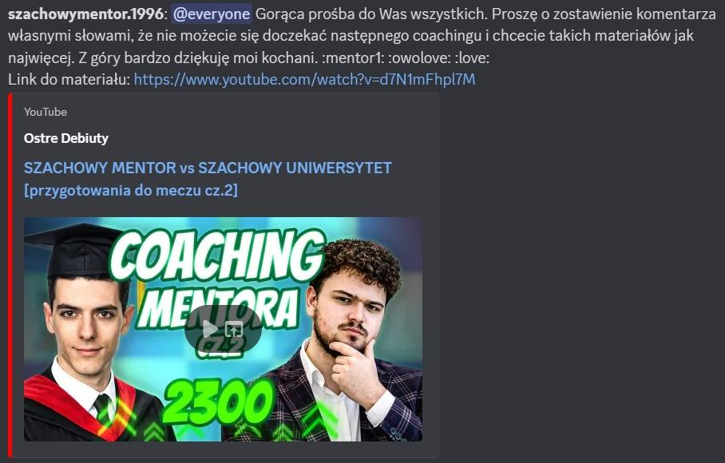
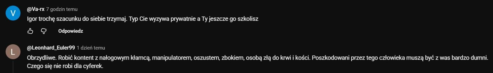
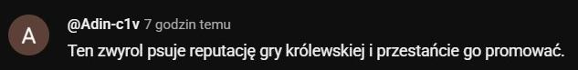
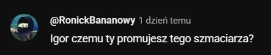

# Edycja Specjalna Adminow: Autopromocja i Komentarze

**Data publikacji:** 25 stycznia 2026  
**Zrodlo:** Glos Waffen (wydanie specjalne)  
**Temat:** Lancuch autopromocji i reakcje spolecznosci

---

## Co sie stalo

Sekcja pokazuje klasyczny schemat publikacyjny:
1. mocne @everyone z autopromocja,
2. szybkie podbicie widocznosci,
3. kontrreakcja w komentarzach.

---

## Wniosek redakcyjny

W materialach widac mocna asymetrie: duzy wysilek promocyjny i jednoczesnie wyrazny opor komentarzowy. To buduje narracje "zasieg jest, ale zaufanie jest kruche".

---

## Powiazania

- [2026-01-25 - edycja specjalna adminow (hub)](../figle/2026-01-25-edycja-specjalna-adminow.md)
- [2026-01-25 - pomoc i moderacja](../figle/2026-01-25-pomoc-i-moderacja.md)
- [2026-01-25 - fitness, lifestyle i restream](../figle/2026-01-25-fitness-lifestyle-restream.md)

---

**Redakcja:** zespol administracyjny / Goscie Glow Waffen
