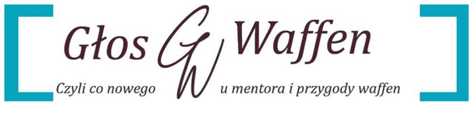

# Edycja Specjalna Adminow: Pomoc, Bany, Autopromocja i Kuchenne Arcydzielo

**Data publikacji:** 25 stycznia 2026  
**Zrodlo:** Glos Waffen (wydanie specjalne "w 100% przez adminow")  
**Temat:** Przekrojowy raport z koncowki stycznia: prosby o pomoc, polityka banow, autopromocja i kacik lifestyle

---

## Co sie stalo

W specjalnym wydaniu zebrano materialy, ktore pokazuja kilka rownoleglych watkow:
- prosby o pomoc i napiecia na czacie,
- intensywna aktywnosc moderacyjna (komendy bota, odbanowania, bany z uzasadnieniami),
- autopromocje z reakcjami spolecznosci,
- watki fitnessowo-kuchenne,
- oraz domkniecie sagi "noc oczyszczenia" wraz z narracja o wspollokatorce.

---

## Podzial na krotsze artykuly

- [2026-01-25 - pomoc i moderacja](../figle/2026-01-25-pomoc-i-moderacja.md)
- [2026-01-25 - autopromocja i komentarze](../figle/2026-01-25-autopromocja-i-komentarze.md)
- [2026-01-25 - fitness, lifestyle i restream](../figle/2026-01-25-fitness-lifestyle-restream.md)

Najwazniejsza korekta faktograficzna pozostaje bez zmian: wpis o "wspollokatorce" traktowany jest jako projekcja/odwrocenie roli, a realne tlo dotyczy konfliktu z Edyta, w ktorym to Mentor byl strona usunieta z lokalu.

---

## Powiazania

- [2025-12-27 - czytanie nagrody kanalowej](../figle/2025-12-27-kacik-czytelniczy.md)
- [2026-01-25 - pomoc i moderacja](../figle/2026-01-25-pomoc-i-moderacja.md)
- [2026-01-25 - autopromocja i komentarze](../figle/2026-01-25-autopromocja-i-komentarze.md)
- [2026-01-25 - fitness, lifestyle i restream](../figle/2026-01-25-fitness-lifestyle-restream.md)
- [2026-01 - kacik figlarski: fake dane](../figle/2026-01-kacik-figlarski-fake-dane.md)
- [2026-01-03 - symultana mentora: porazka i wymowki](../figle/2026-01-03-symultana-mentora-przegrana.md)
- [2026-01-04 - zakup mieszkania i kalkulator kredytowy](../figle/2026-01-04-kupno-mieszkania-kredyt.md)
- [Restreamy i archiwum transmisji](../figle/restreamy-i-archiwum.md)

---

**Redakcja:** zespol administracyjny / Goscie Glow Waffen  
**Wydanie:** styczen 2026 (edycja specjalna)
