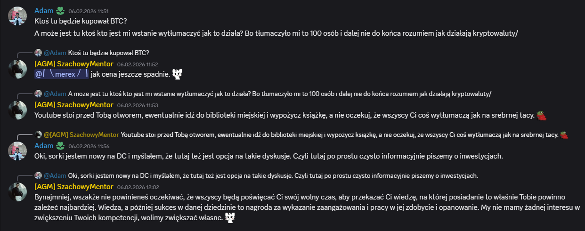
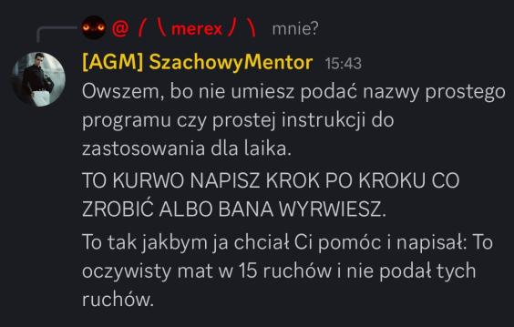
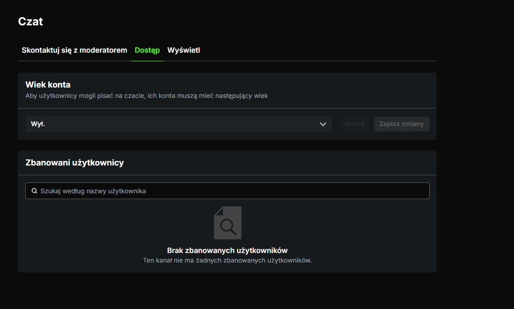
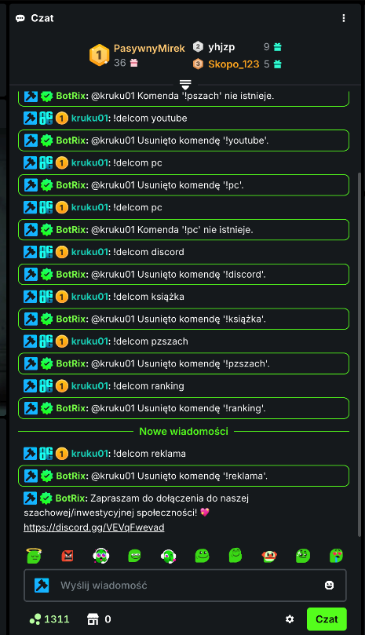
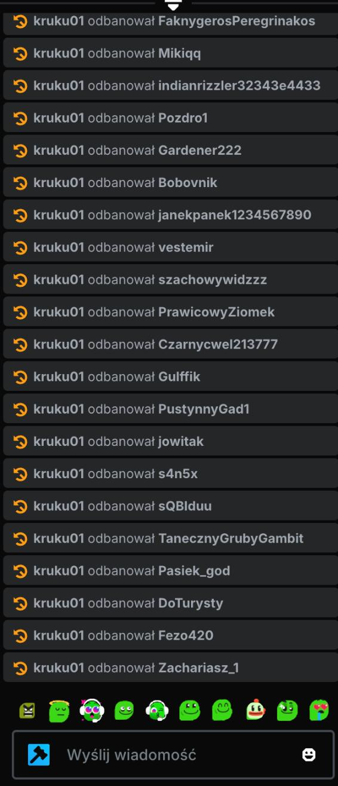
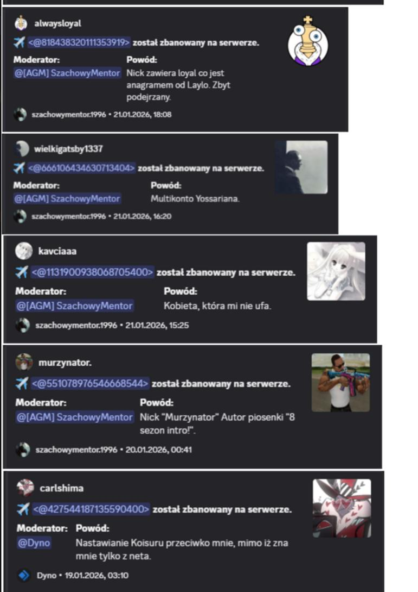
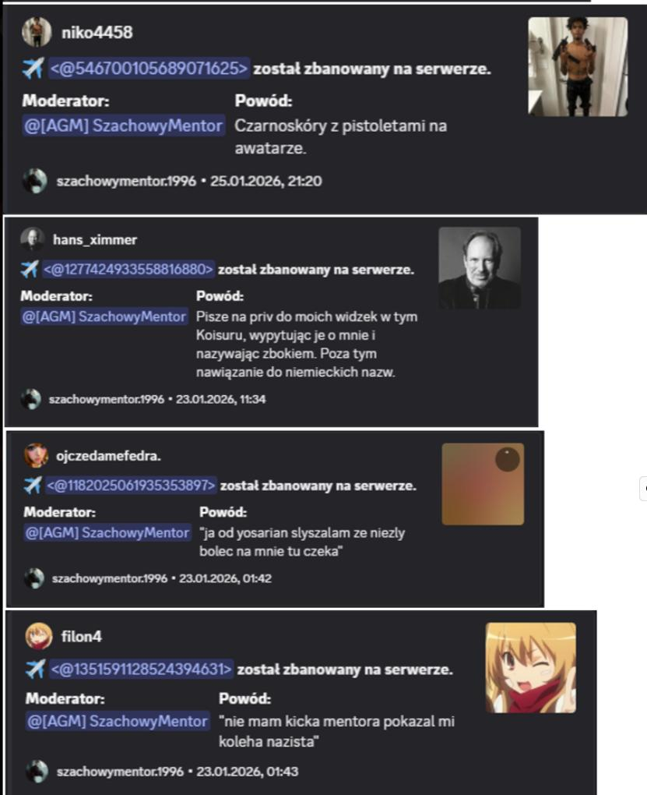

# Edycja Specjalna Adminow: Pomoc i Moderacja

**Data publikacji:** 25 stycznia 2026  
**Zrodlo:** Glos Waffen (wydanie specjalne)  
**Temat:** Eskalacja komunikacji i intensywna aktywnosc moderatorska

---

## Co sie stalo

W tej czesci wydania widac dwa polaczone watki:
- prosbe o pomoc techniczno-finansowa i szybka eskalacje tonu,
- porzadkowanie czatu oraz masowe decyzje moderatorskie.

---

## Dzialania moderatorskie

Zrzuty dokumentuja trzy poziomy interwencji:
- ustawienia i porzadkowanie czatu,
- usuwanie komend bota,
- odbanowania i bany z rozbudowanymi powodami.

---

## Wniosek redakcyjny

Material pokazuje wzorzec: wysoki poziom emocji + szybkie i szerokie decyzje porzadkowe. W praktyce to miks kryzysowego stylu komunikacji i administracyjnego domykania kanalu.

---

## Powiazania

- [2026-01-25 - edycja specjalna adminow (hub)](../figle/2026-01-25-edycja-specjalna-adminow.md)
- [2026-01-25 - autopromocja i komentarze](../figle/2026-01-25-autopromocja-i-komentarze.md)
- [2026-01-25 - fitness, lifestyle i restream](../figle/2026-01-25-fitness-lifestyle-restream.md)

---

**Redakcja:** zespol administracyjny / Goscie Glow Waffen
