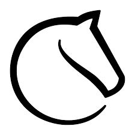

# Kącik Figlarski: Mentor Nabrany na Fake Dane

**Data publikacji:** 8 stycznia 2026  
**Źródło:** Głos Waffen (Redakcja: Szałwia)  
**Temat:** Zorganizowana kampania żartów z fake danymi (LinkedIn, Instagram), w którą Mentor uwierzył

---

## Co się stało

Zespół figlarzy (Laylo, Szałwia, Yossarian) zorganizował akcję żartów na Mentora, publikując **fake konta** z nazwiskami ludzi i danymi. Mentor wpadł w pułapkę i **zaczął publikować te dane na streamie**.

## Fake Profile

### 1. Mateusz Wilkowski (LinkedIn) — wulfhood

**Profil:** https://www.linkedin.com/in/mateusz-wilkowski-476391374/

**Analiza:** Każdy rozgarnięty użytkownik lindekin po **3 minutach przeglądania** widzi że to **fake**:
- Nieautentyczne dane profilowe
- Dziwne historie zawodowe
- Brak logiki chronologicznej

Mentor **uwierzył i potraktował to poważnie**.

### 2. Kamil Szałwiński (Instagram) — Szałwia Sam

**Profil:** https://www.instagram.com/szalwia.x/#

**Analiza:** Fake jest **oczywisty** po 2 minutach:
- Data dołączenia jest podejrzana (zbyt nowa)
- Nieautentyczne zdjęcia
- Brak spójności profilu

Mentor znowu **uwierzył**.

### 3. Kacper Wiśniewski — Yossarian

Skąd się wzięła ta osoba?

**Historia:**
1. Yossarian **"w akcie zemsty"** zleakował to "imię" na Haxballu (gra online, podbicie w piłkę)
2. Robi to **po tym, jak Laylo wysłał fałszywy LinkedIn Walkowskiego**
3. Kacper Wiśniewski okazał się być **innym fake imieniem**

---

## Jak się Mentor Nabrał?

### Metodologia Żartu

Figlarze wysyłali Mentorowi:
- Profilowe zdjęcia
- Dane kontaktowe
- "Rekomendacje"
- Medialkach z "medalkami serduszkiem" które otwierały się i pokazywały dane

Mentor:
- **Czytał je na streamie**
- **Komentował je**
- **Robił z siebie debila** (wg. redakcji)

### Ostrzeżenie od Społeczności

Szałwia zwraca uwagę: **każdy bardziej rozgarnięty użytkownik** widzi od razu że to fake, ale Mentor:
- Spędzał czasu udzielając se komentarzy
- Rozpowszechniał fake dane
- Nie robił **nawet 3 minuty researchu**

---

## Konkluzja Redakcji

> "Srebrnemu baronowi radzimy zrobić 3 minuty researchu, zanim zacznie takie dane mówić na streamie i robić z siebie debila"

Mentor wykazał się:
- **Brakiem krytycznego myślenia**
- **Bezmyślnym rozpowszechnianiem danych**
- **Łatwością do oszukania** (fake LinkedIn/Instagram)
- **Publikowaniem fake danych bez weryfikacji**

---

## Screenshots

---

## Powiązania

- [2024-01 - Fabryka Fejk Kont i Tożsamość "Lady Hetman"](../figle/2024-01-fabryka-fejk-kont-i-lady-hetman.md)
- [2025-12 - Analiza Stylu Manipulacyjnego Mentora](../zwiazki/2025-12-analiza-stylu-manipulacyjnego.md)
- [Pseudonimy Szachowego Mentora](../figle/pseudonimy-szachowego-mentora.md)

---

**Redakcja główna:** Szałwia  
**Wymiana:** Głos Waffen (8.01.2026)
