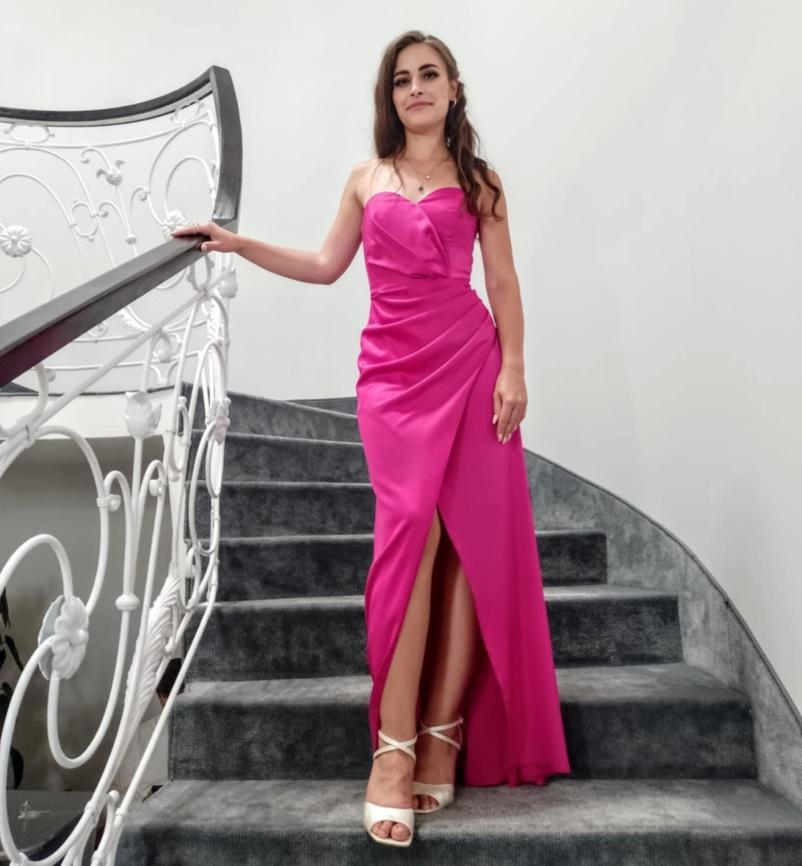
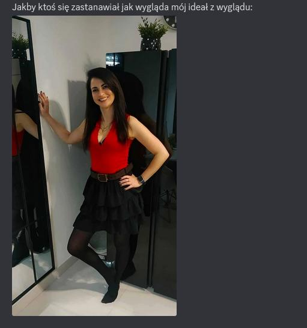
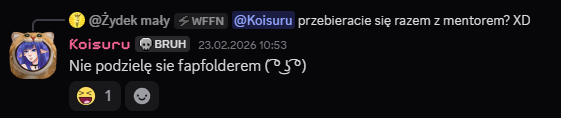
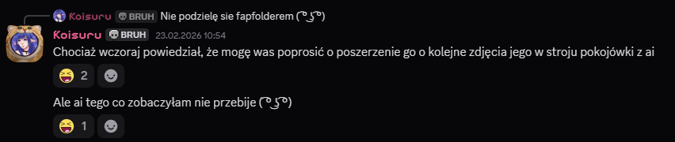
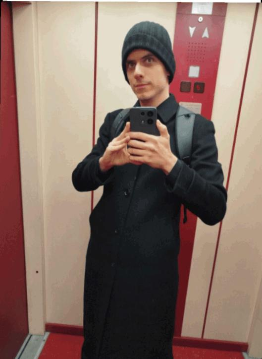
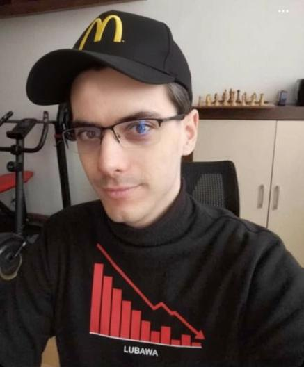

# 2026-02 - cosplay i crossdressing

## Co sie stalo

W segmentach "Kacik Cosplay" opisano rozmowy sugerujace, ze przebieranki i stylizacje sa elementem narracji wokol mentora i Koisuru.
Material laczy watki konwentowe, streamowe i intymne, podane w tonie satyrycznym.

## Kto bral udzial

- Szachowy mentor
- Koisuru
- uczestnicy kanalu Mentorek
- redakcja podpisana jako Jad

## Przebieg

W relacji pojawiaja sie trzy glowne punkty:
- sygnaly o strojach cosplayowych i deklaracje ich potencjalnego wykorzystania na streamie
- wzmianki o crossdressingu mentora (opisane jako kontynuacja starszych plotek)
- reakcja spolecznosci, ktora zaczela proponowac konkretne kreacje i fundowanie strojow

W praktyce temat zostal przedstawiony jako mieszanka performansu, humoru i marketingu streamowego.

## Zrzuty i material graficzny

Uwaga redakcyjna: ponizsze dwa zdjecia sylwetek nie przedstawiaja Koisuru.

## Linki i klipy

- brak jawnego URL bezposrednio pod ta sekcja w dostarczonym fragmencie

## Powiazania

- [2026-02 - kaciki specjalne: cosplay, dobranocka, walentynki i Wiedzmin 3](2026-02-kaciki-specjalne-cosplay-dobranocka-walentynki.md)
- [Pseudonimy Szachowego Mentora](pseudonimy-szachowego-mentora.md)
- [Rejestr autorstw artykulow](../postacie/waffenowcy/autorstwa-artykulow.md)
