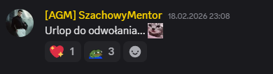
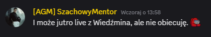
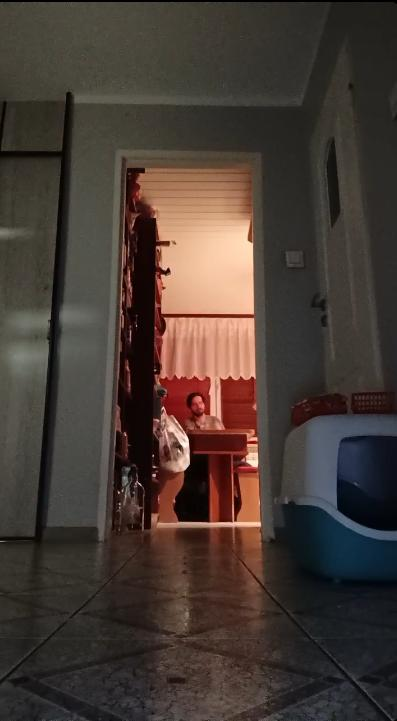
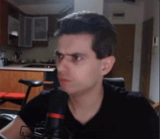

# 2026-02 - mentor meczennik czy len

## Co sie stalo

W koncowce lutego 2026 redakcja opublikowala segment o dluzszej nieobecnosci mentora na streamie.
Teza materialu byla taka, ze brak transmisji wynikal bardziej z priorytetow i rutyny dnia niz z deklarowanych przeszkod zewnetrznych.

## Kto bral udzial

- Szachowy mentor
- redakcja podpisana jako Prorok z Jezdzieckiej
- redakcja uzupelniajaca: Alk. Szalwia oraz Pomidor (edycja i korekta)

## Przebieg

Po ponad tygodniu bez streama pojawil sie komunikat mentora sugerujacy mozliwy powrot transmisji z Wiedzmina.
W komentarzu redakcyjnym glowna hipoteza wskazywala na duza liczbe godzin spedzonych w Vampire Survival jako realny powod przerwy.
Na koniec opublikowano satyryczne podsumowanie i krotka "ciekawostke" podpisana przez kolejnego autora.

## Zrzuty i os czasu przerwy

## Skutek

Segment utrwalil obraz lutowej przerwy jako kolejnego punktu sporu o wiarygodnosc deklaracji mentora.
W praktyce temat zasilil narracje o rozjezdzaniu sie planow publicznych z codzienna aktywnoscia streamera.

## Linki i klipy

- brak jawnego URL do screena z liczba godzin w dostarczonym fragmencie

## Powiazania

- [Restreamy i archiwum transmisji](restreamy-i-archiwum.md)
- [Cele finansowe i inwestycyjne mentora](../inwestycje/cele-finansowe-i-inwestycyjne-mentora.md)
- [Rejestr autorstw artykulow](../postacie/waffenowcy/autorstwa-artykulow.md)
