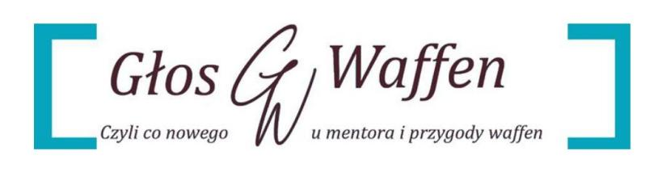
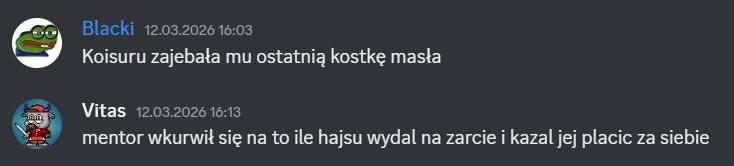
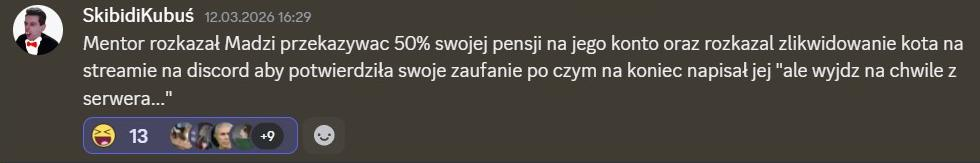
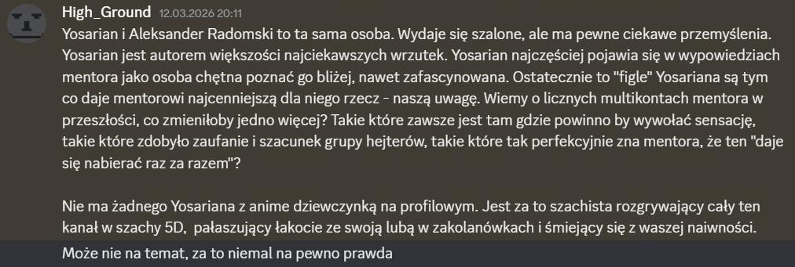
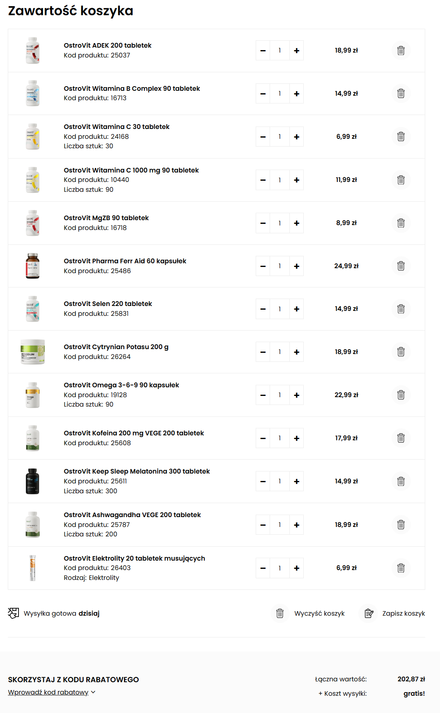

# Kącik teorii spiskowych: Degradacja!

Kilka dni temu w Uszatym Uniwersum miało miejsce dość ciekawe zdarzenie. Królowa serwera — Koisuru została na kilka godzin zdegradowana do rangi [Prokurator], co wywołało niemałe poruszenie wśród fanów Szachowego Mentora.

## Zdarzenie

Choć powody, dla których nastąpiło zdegradowanie, nie są publiczne, społeczność szybko zaczęła wysuwać różne teorie dotyczące całej sytuacji.

## Spekulacje społeczności

Wśród najczęściej pojawiających się hipotez znalazły się:
- możliwe konflikty wewnątrz zespołu moderacji serwera
- zmiany w hierarchii i zasadach zarządzania
- humorystyczne interpretacje całej sytuacji przez community
- analiza wpływu tego wydarzenia na dynamikę grupową i relacje interpersonalne
- spekulacje dotyczące przyczyn technicznych lub polityki serwera

Większość komentarzy miała charakter żartobliwy, jednak część użytkowników próbowała analizować rzeczywiste przyczyny zmiany statusu.

## Galeria

---

**Materiały pokrewne:**
- [Kącik życzeniowy](2026-03-kacik-zyczeniowy.md)
- [Przegląd materiałów z marca 2026](2026-03-kaciki-tematyczne-przeglad-materialow.md)
