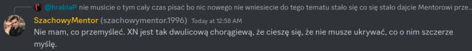

# Kącik życzeniowy

Duża część materiału skupia się na zarzutach wobec Mentora dotyczących nadmiernego skupienia na statystykach, popularności oraz rozwoju kanału.

## Udział w community events

Jako przykład podawany jest jego udział w quizie społecznościowym, który według krytyków miał służyć przede wszystkim zwiększeniu aktywności streama i poprawieniu wyników kanału. Po wydarzeniu pojawiły się komentarze sugerujące, że Mentor traktuje relacje w community bardziej instrumentalnie niż koleżeńsko.

# Kącik życzeniowy

Duża część materiału skupia się na obserwacjach dotyczących podejścia Mentora do statystyk, popularlności i rozwoju kanału.

## Uczestnictwo w community eventach

Jako przykład podawany jest jego udział w quizie społecznościowym, który według krytyków miał służyć przede wszystkim zwiększeniu aktywności streama i poprawieniu widoczności kanału. Wydarzenie trwało krótko - po jego zakończeniu Mentor wycofał się z serwera Discord społeczności już kilka godzin później.

Obserwatorzy zwrócili uwagę, że transmisja streama Mentora zaczęła się tuż po otrzymaniu statusu partnera na platformie, co sugeruje celową synchronizację dla maksymalnej widoczności.

## Problematyczne wypowiedzi publiczne

Spora część materiału dokumentuje kontrowersyjne wypowiedzi Mentora wobec innych osób, często zawierające:
- obraźliwe określenia
- publiczne wyśmiewanie użytkowników i twórców
- negatywne komentarze dotyczące wyglądu fizycznego
- emocjonalne i nieproporcjonalne reakcje na krytykę

Wiele z tych wypowiedzi było później opisywane jako ironia lub żarty, jednak odbiorcy często interpretowali je jako agresywne i niewłaściwe.

## Chronologia konfliktów

Spora część dokumentacji dotyczy wypowiedzi wobec konkretnych osób, gdzie Mentor:
- zmienił kwalifikacje swojego zachowania z "żartu" na "ironie" i "grę"
- wielokrotnie powtarzał problematyczne stwierdzenia na przestrzeni czasu
- wydawał się bezpośrednio adresować osoby ze społeczności

## Najczęściej powtarzające się zarzuty

- impulsywny styl komunikacji
- obraźliwy język wobec osób ze społeczności
- przesadne reagowanie na krytykę
- konflikty z innymi twórcami i użytkownikami
- silne skupienie na zasięgach i internetowej popularności
- brak konsekwencji w tłumaczeniach swoich zachowań

## Galeria

---

**Materiały pokrewne:**
- [Kącik bokserski](2026-03-kacik-bokserski.md)
- [Community trollerskie](2026-03-kacik-community-trollerskie.md)
- [Przegląd materiałów z marca 2026](2026-03-kaciki-tematyczne-przeglad-materialow.md)
