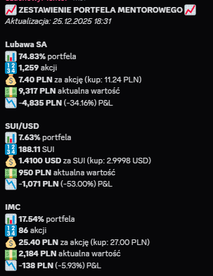
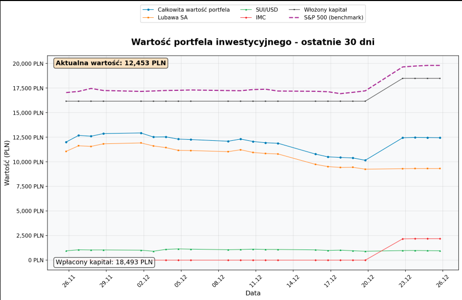

# 2025-12 - Kącik Inwestycyjny: IMC Spada do -6%, Mentor Uczy się Trudnych Lekcji

## Co się stało

W Głosie Waffen pojawiło się reasumpcje portfela inwestycyjnego mentora z datą 25.12.2025.
Najważniejsza część: inwestycja w ukraińską spółkę mleczną **IMC** spadła do **-5.93% (prawie -6%)**.
Redakcja opisuje to z sarkazmem: "Zapytacie jak przebiega kurs ukraińskiej spółki mlecznej po jego inwestycji? Otóż zaczął spierdalać w dół, obecnie dobił już do -6%."

## Kto brał udział

- Szachowy mentor (inwestor, posiadacz portfela)
- IMC (Ukrainian Dairy Company)
- Redakcja Głosu Waffen (dokumentujący porażkę)

## Stan Portfela

### Dane z 25.12.2025, 16:31

| Inwestycja | Wartość portfela | Akcji | Wartość za akcję | Zmiana | PGL |
|------------|------------------|-------|------------------|--------|-----|
| **Lubawa SA** | 74.8% portfela | 1,259 | 7.40 PLN | - | +34.16% |
| **SUI/USD** | 7.63% portfela | 188.11 | 14,100 USD | - | -53.00% |
| **IMC** | 17.54% portfela | 86 akcji | 25.40 PLN | -138 PLN | -5.93% |

### Podsumowanie
- **Całkowita wartość portfela**: 12,453 PLN
- **Wdrażony kapitał**: 18,493 PLN (czyli **strata**: -6,040 PLN, czyli **-32,7%**)

## Analiza IMC Inwestycji

### Co Poszło Nie Tak

1. **Sektor**: Ukraińska spółka mleczna (IMC)
   - Przedsiębiorstwo ma problemy: Ukraina jest w stanie wojny
   - Sektor mleczny jest wrażliwy na ceny paliw, koszty logistyki
   - Mentor inwestował w **wysoko ryzykowne papiery**

2. **Timing**: December 2025
   - W grudniu 2025 sytuacja na Ukrainie nie poprawiła się
   - Mentor kupował na szczycie lub przed spadkiem

3. **Diversyzacja**: Portfel dominowany przez Lubawę SA
   - Lubawa: +34.16% (`to jest jedyna zyska`)
   - Reszta: duże spadki
   - Mentor stawiał zbyt wiele na jedną inwestycję

### Finansowe Skutki

**Wdrożony kapitał: 18,493 PLN**
**Aktualna wartość: 12,453 PLN**
**STRATA: -6,040 PLN (-32,7%)**

W ciągu kilku miesięcy portfel spadł o **jedną trzećą**.

## Psychologia Mentora-Inwestora

### 1. Pewność Siebie Wyższa Niż Wiedza

Mentor angażuje się w inwestycje (zwłaszcza zagraniczne/ryzykowne) bez wystarczającej analizy.
"Spółka mleczna na Ukrainie" to nie jest intuicyjnie bezpieczna inwestycja.

### 2. Ignorowanie Fundamentów

Fakt, że Ukraina jest w wojnie, gdyż normalnie **powinna zniechęcić** do inwestycji w ukraińskie przedsiębiorstwa.
Mentor albo:
- Nie wiedział o stanie Ukrainy
- Liczył na "szybki zysk"
- Wierzył w przekazy marketingowe spółki

### 3. Brak Odpowiedzialności

Kiedy portfel pada, mentor **nie analizuje błędów**.
Redakcja mówi: "Liczymy na dalsze tak udane zakupy Szachowy Spellu" — to sarkastycznie.
Mentor nie uczy się z porażek.

## Skutek

### Krótkoterminowo
- Strata 6,040 PLN na jednej inwestycji
- Ekspozycja w mediach (Glos Waffen ujawnia)
- Humiliacja publiczna

### Długoterminowo
- Dowód, że mentor **podje ryzykowne decyzje finansowe**
- Potencjalny brak umiejętności zarządzania pieniędzmi
- Pytanie: czy to są jego pieniądze, czy zebrane ze społeczności?

### Dla Społeczności
Jeśli mentor zbierał pieniądze na "inwestycje" lub promował te inwestycje:
- To jest pośredni dowód **niskiej jakości porad finansowych**
- Mentor nie jest kompetentnym doradcą inwestycyjnym

## Powiązania

- [2025-12 - plany na przyszłość mentora](../../inwestycje/2025-12-plany-na-przyszlosc-mentora.md)
- [2024-11 - finanse, inwestycje i priorytety wydatkowe mentora](../../inwestycje/2024-11-finanse-inwestycje-i-priorytety-wydatkowe-mentora.md)
- [2025-12 - Kącik Zakupowy: paragon i mandarynki](2025-12-kacik-zakupowy-paragon-mandarynki.md)
- [Głos Waffen - archiwum](../../../zrodla/README.md)
- [Szachowy mentor](../../profil/szachowy-mentor.md)

## Screeny

