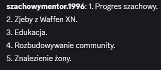

# 2025-12 - plany na przyszlosc mentora

## Co sie stalo

6 i 10 grudnia 2025 mentor szeroko opowiadal o planach zyciowych, finansowych i zawodowych.
Wypowiedzi laczyly ambicje dlugoterminowe (mieszkanie, inwestycje, rodzina, biznes) z frustracja zwiazana z poczuciem marnowania czasu.
Pakiet zapisal sie jako publiczna lista celow, ale tez jako auto-diagnoza bezsilnosci i przeciagania wielu tematow naraz.

## Kto bral udzial

- Szachowy mentor
- widzowie streama
- redakcja opisujaca material

## Trigger

Triggerem byla seria grudniowych kryzysow wokol streamingu i nastroju mentora, przez co zaczal publicznie bilansowac priorytety i poczucie sprawczosci.

## Przebieg

### 6 grudnia - lista marzen i celow

Podczas streama mentor wymienial cele, ktore uznaje za kluczowe:
- brak problemow finansowych
- wlasne mieszkanie i obawa przed utrata stabilnosci mieszkaniowej
- zostanie mistrzem szachowym
- inwestowanie na gieldzie do konca zycia
- zbudowanie dochodu pasywnego
- biznes oparty o handel internetowy
- czytanie jednej ksiazki co 2 tygodnie dla rozwoju kompetencji
- budowanie formy na silowni domowej
- zalozenie rodziny (2 dzieci)
- nauka angielskiego do poziomu bardzo wysokiego
- prawo jazdy
- zakup czarnego Jaguara (w materialach padaly rozne pulapy cenowe)

Material klipowy:
- https://streamable.com/a2d572

### 10 grudnia - ton bardziej autorefleksyjny

W aktualizacji z 10 grudnia mentor pisal o marnowaniu czasu i bezsilnosci.
W przekazie pojawil sie motyw "przeblysku" i proby bardziej trzezwego spojrzenia na to, co streaming daje, a co odbiera.

## Skutek

Pakiet "planow na przyszlosc" stal sie jednym z glownych punktow odniesienia w dyskusji o tym, czy mentor jest w stanie dowiezc deklarowane cele.
Z jednej strony pokazal duza ambicje, z drugiej odslonil przeciazenie i rozjazd miedzy lista planow a codzienna praktyka.

## Linki i klipy

- https://streamable.com/a2d572

## Powiazania

- [Cele finansowe i inwestycyjne mentora](cele-finansowe-i-inwestycyjne-mentora.md)
- [Grudzien 2025 - wydarzenia wokol moderacji i streamingu](../figle/2025-12-wydarzenia.md)
- [2025-12 - mentor zawiesza kariere streamerska](../figle/2025-12-mentor-zawiesza-kariere-streamerska.md)
- [Szachowy mentor](../profil/szachowy-mentor.md)
