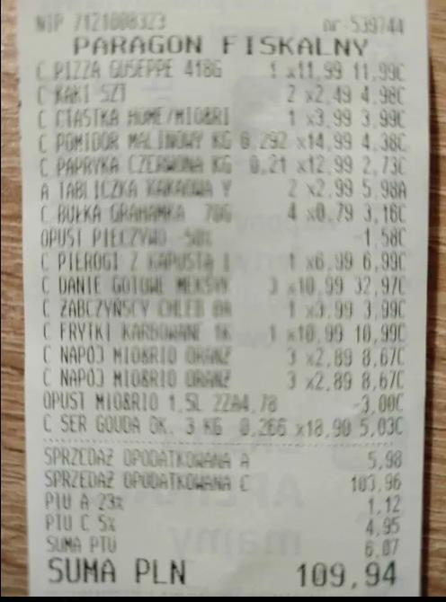

# 2025-12 - Kącik Zakupowy: Paragon za 109,94 PLN i 7,5 kg Mandarynek

## Co się stało

W Głosie Waffen z grudnia 2025 pojawił się "Kącik Zakupowy" z paragorem z Paragon Fiskalnego.
Mentor pochwalił się swoimi zakupami — między innymi dużą ilością mandarynek.
Redakcja zanotowała: "Mentorek ostatnio pochwalił się kolejny raz swoimi zakupami. Zapraszam do analizy tego oto paragonu. Dodam również, że zakupił 7.5 kg mandarynek."

## Kto brał udział

- Szachowy mentor (kupujący)
- Sklep (miejsce zakupů)
- Redakcja Głosu Waffen (dokumentujący zakupy)

## Treść Paragonu

**Paragon Fiskalny**
Suma: **109,94 PLN**

Pozycje zakupów (częściowo czytelne):
- Parapetowe produkty żywnościowe
- Jabłko/Śliwka/Owoce (wieloetapowe)
- Produkty zdrożytkowe (chleb?)
- Mandarynki — **7,5 kg** (niemal połowa wartości całego koszyka?)
- Inne warzywa i napoje

### Analiza Paragonu

| Kategoria | Ilość (szacunkowa) | Cena szacunkowa |
|-----------|-----------|----------|
| **Mandarynki** | 7,5 kg | ~50-60 PLN |
| **Owoce** (jablko, sliwka) | Wielorazowe | ~20-30 PLN |
| **Produkty schłodzane** | N/A | ~20 PLN |
| **Warzywa** | N/A | ~10-15 PLN |
| **RAZEM** | | **109,94 PLN** |

## Analiza Zachowania Mentora

### 1. Obsesja na Owocach/Mandarynkach

Mentalist pojawia się w kontekście "pochwalił się swoimi zakupami" — czyli **nie jest to normalny zakup, ale coś wartego ujawnienia**.

7,5 kg mandarynek to **dużo** na jedną osobę. To sugeruje:
- Stockowanie na wiele dni
- Obsesja na owocach
- Przygotowanie do czegoś (rekomendacja dla widzów? pokaz na streamie?)

### 2. Publiczna Promocja Codziennych Czynności

Mentor **dzieli się swoimi zakupami** z widzami.
To może wynikać z:
- Chęci bycia "relatable" ("patrzcie, ja też kupuję zwyczajnie")
- ASMR-owego zainteresowania do szczegółów ("w jakiej ilości kupu")
- Narcystycznej potrzeby pokazywania swojego życia

### 3. Paragon jako "Dowód"

Fakt, że Redakcja przeanalizować może dokładny paragon:
- Mentorbył on wystarczająco ważny do ujawnienia
- Mentor dzielił się tym na streamie lub publicznie
- Szczegółowość (7,5 kg) sugeruje, że mentor **sam poinformował ludzi o ilości**

## Aspekt "Obsesji Szczegółów"

To jest kolejny dowód wzoru mentorowego: **szufladkowanie poprzez liczby i szczegóły**.

- "Rozmiar 44" (stópki)
- "7,5 kg" (mandarynki)
- "50 wiadomości" (wymög na Discord)
- "3 miesiące" (wiek kont do verifikacji)

Mentor lubi **precyzyjne, mierzalne kategorie**, które mogą być **kontrolowane i monitaryzowane**.

## Skutek

### Krótkoterminowo
- Ujawnienie zwyczajnych zakupów
- Potencjalna humiliacja (jeśli jakiś aspekt jest "dziwny")
- Dzielenie się szczegółami ze społecznością

### Długoterminowo
- Przykład mentorowego _attention-seeking_ zachowania
- Dowód, że mentor **nieniedostarczu jest znaczenia do trivialnych szczegółów** (7,5 kg mandarynek)
- Możliwy wzór: mentor angażuje społeczność w bardzo osobiste detale

## Powiązania

- [2025-12 - Kącik Inwestycyjny: IMC Spada](../inwestycje/2025-12-kacik-inwestycyjny-imc.md)
- [2025-12 - analiza stylu manipulacyjnego mentora](../zwiazki/2025-12-analiza-stylu-manipulacyjnego.md) (obsesja na liczbach/szczegółach)
- [2024-11 - finanse, inwestycje i priorytety wydatkowe mentora](../inwestycje/2024-11-finanse-inwestycje-i-priorytety-wydatkowe-mentora.md)
- [Głos Waffen - archiwum](../../zrodla/README.md)
- [Szachowy mentor](../profil/szachowy-mentor.md)

## Screeny

