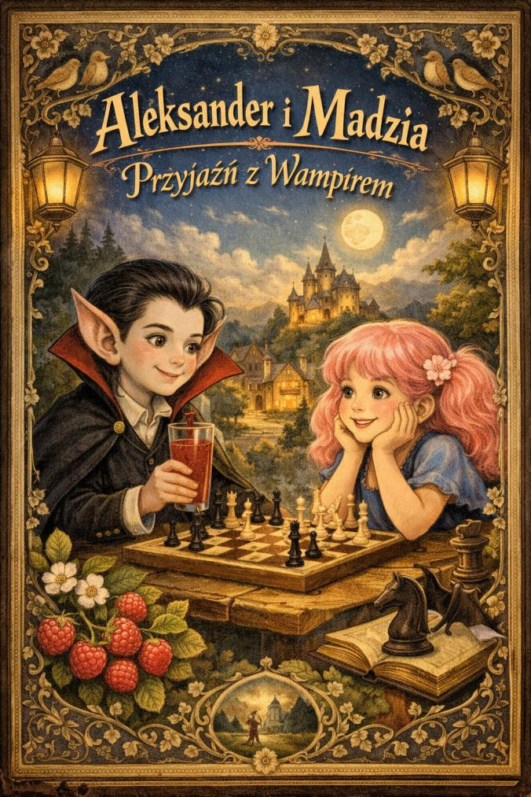

# 2026-02 - list otwarty do Koisuru

## Co sie stalo

W materiale redakcyjnym opublikowano bezposredni list do Koisuru, utrzymany w tonie ostrzegawczym.
List koncentrowal sie na transparentnosci relacji z mentorem i na zarzutach o niespojnosc jego publicznych narracji.

## Kto bral udzial

- Koisuru
- Szachowy mentor
- redakcja podpisana jako Alyson Stark

## Przebieg

Autorka listu podniosla kilka osi tematycznych:
- ukrywanie relacji i rownolegla narracja o fejk imieniu "Natalia" uzywanym na Magdalene Koisuru
- publiczne i prywatne wersje tej samej historii
- nacisk na poklask i kontrolowanie przekazu
- pytanie o granice szczerych rozmow w zwiazku

W dalszej czesci list przechodzi w ostrzezenie o ryzyku emocjonalnym i apel o samodzielna ocene zachowan partnera.
Ton tekstu jest emocjonalny, ale konstrukcja pozostaje argumentacyjna: pytania, kontrpytania, wskazanie niespelnionych wyjasnien.

## Zrzut uzupelniajacy

## Linki i klipy

- brak jawnego URL bezposrednio pod listem w dostarczonym fragmencie

## Powiazania

- [2026-02 - oda do Koisuru i wywiad srodowiskowy](2026-02-oda-do-koisuru-i-wywiad.md)
- [2026-02 - transkrypcje wywiadu z Magdalena "Natalia" Koisuru](2026-02-transkrypcje-wywiadu-z-magdalena-natalia.md)
- [Szachowy mentor](../profil/szachowy-mentor.md)
- [Rejestr autorstw artykulow](../postacie/waffenowcy/autorstwa-artykulow.md)
