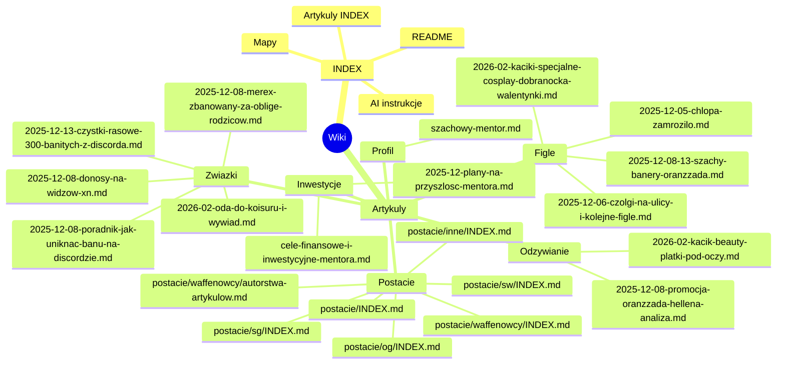
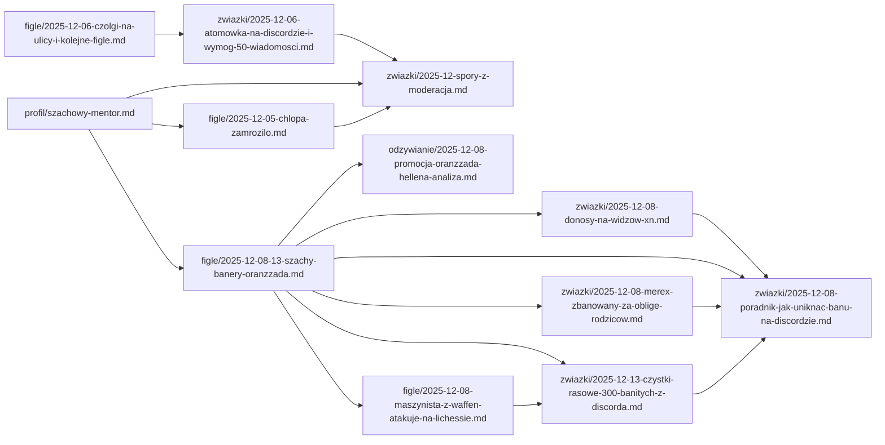

# Mapa wiki - Szachowy mentor

Render interaktywny na GitHub Pages jest wymuszony skryptem na dole strony.

## 1) Struktura wiki (hierarchia)

## 2) Kluczowe powiazania artykulow (grudzien 2025 + konsekwencje)

